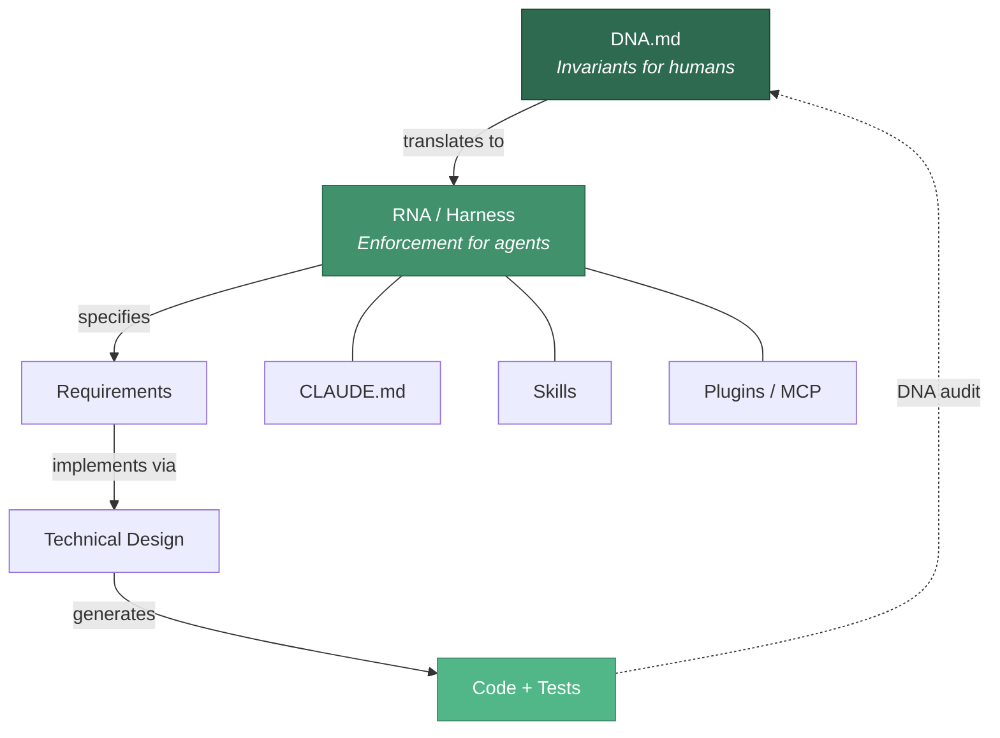
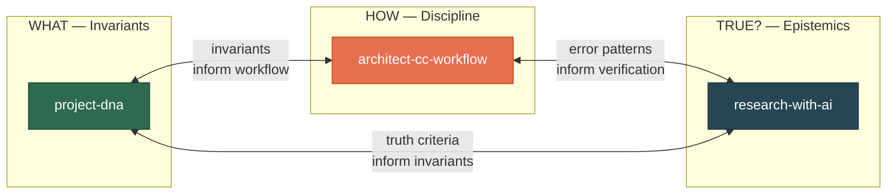
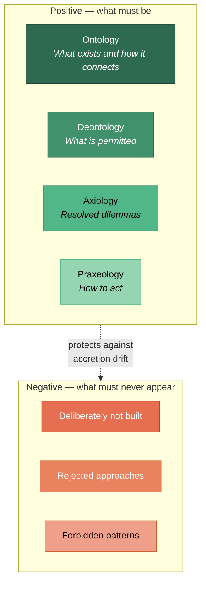
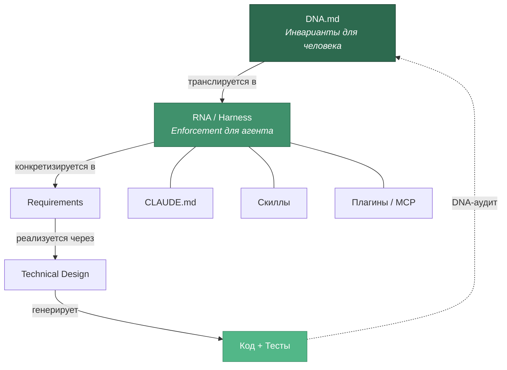
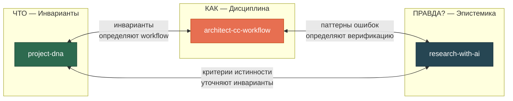
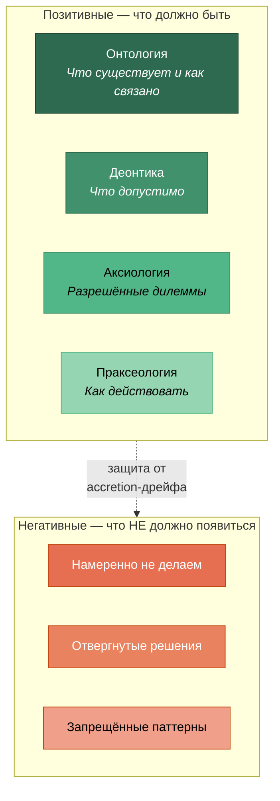

# Project DNA

> **EN** | [RU](#project-dna-ru)

**Root project documents with implementation-independent invariants for AI-assisted development.**

DNA (Decision Nucleic Acid) is a compact document (2-5 pages) capturing only decisions that hold true **regardless of implementation** — no technology names, no frameworks, no models. Just "what" and "why".



## The Problem

When working with AI coding agents, the biggest risk is not bad code — it's **code that solves the wrong problem**. The agent writes excellent code that passes all tests — but the tests check the wrong things because nobody wrote down what actually matters.

DNA prevents this by giving agents a set of **invariants** they must never violate, while leaving implementation decisions flexible.

## Three-Skill Ecosystem

Project DNA works as part of a three-skill system. Each skill covers a different aspect:



| Skill | Domain | Key Question |
|-------|--------|-------------|
| **project-dna** | Invariants | *What can never be violated and why?* |
| **architect-cc-workflow** | Execution discipline | *How do both sides catch each other's errors?* |
| **research-with-ai** | Epistemics | *How do we know this is true?* |

The three skills fire in sequence and pair up mechanism-for-mechanism:

```
research-with-ai (Mode 8)  →  project-dna  →  architect-cc-workflow
  domain scouting             invariants       execution
```

| project-dna | ↔ | architect-cc-workflow |
|---|---|---|
| Violation indicator | ↔ | Regression suite (§16) |
| Pre-action protocol | ↔ | Phase-end report |
| Numeric invariants (§7) | ↔ | Verification anchors (§14.1) |

## Quick Start

**New project?** Say: *"Let's create a DNA for this project"*

**Existing project?** Say: *"Extract DNA from this codebase"* or *"Run a DNA audit"*

Full step-by-step guide: **[Quickstart EN](docs/quickstart-en.md)** | **[Quickstart RU](docs/quickstart-ru.md)**

## Six Modes

| Mode | Trigger | What it does |
|------|---------|-------------|
| **Create DNA** | "create DNA", "start project" | Crystallize domain knowledge into a DNA document |
| **DNA Audit** | "DNA audit", "check compliance" | Compare code against DNA invariants, report violations |
| **Extract DNA** | "extract DNA", "what are our invariants" | Reverse-engineer DNA from existing codebase |
| **Mutate DNA** | "update DNA", "this decision changed" | Safely update DNA with versioning and impact analysis |
| **Create RNA** | "create RNA", "create harness" | Translate invariants into stack-specific rules |
| **Subtraction Audit** | "what to remove", "project has sprawled" | Find what to delete — counteract accretion drift |

Detailed mode descriptions: **[Modes EN](docs/modes-en.md)** | **[Modes RU](docs/modes-ru.md)**

## The Core Criterion: Violation Indicator

**An invariant you cannot observably violate is not an invariant — it's a slogan.**

Every invariant in DNA must carry a **violation indicator**: a concrete, observable state of code, data, or behavior that shows the invariant is broken.

```
Bad:   "Quality takes priority over speed"
       → no state can be pointed to as a violation

Good:  "No conclusion is published without a source reference"
       Violation indicator: output artifact contains a record with
       a non-empty value and an empty provenance field
```

If you can't formulate a violation indicator, it's one of three things: a value (goes to axiology as a resolved dilemma), a hypothesis (goes to `ASSUMPTIONS.md`), or a formulation too broad to check (narrow it).

## Invariants vs Hypotheses

|  | `DNA.md` | `ASSUMPTIONS.md` |
|---|---|---|
| Contains | Invariants | Hypotheses |
| Changes | Only via formal mutation | As they get tested — normal work |
| Status | — | `VERIFIED` / `UNVERIFIED` / `FAILED` |

The test: **what would have to happen for this to stop being true?** "Nothing, it's a property of the domain" → invariant. "We might discover we were wrong" → hypothesis.

Mixing them is why DNA either fossilizes (hypotheses can't be revised because "it's DNA") or becomes worthless (rewritten weekly because "it all changes anyway").

## The Four Layers

DNA is built on four philosophical layers, each with **two sides** — positive (what must be) and negative (what must never appear):



Most DNA documents record only the positive side. That's a mistake: without explicit **negative invariants** a project sprawls through accretion — each addition looks reasonable on its own, and the sum destroys coherence. Strong products are defined not by what's in them but by what is **deliberately absent**.

Axiology is **resolved dilemmas**, not a list of values. An agent can't apply a list of good things; it can only apply a rule of choice: *"when A and B are incompatible → choose A, because […]"*.

## Enforcement: rule versus intention

Every rule in these skills carries an honest rung on a six-step ladder, from
"text in the skill" (an intention) up to "architectural impossibility". The rung
is set by how external the check is — writing FORBIDDEN in the text does not
raise it. A specification begins at rung 5, where something outside the model
fails when the rule is broken.

Three dependency-free lints do that failing:

| Script | Checks |
|---|---|
| `dna_lint.py` | DNA structure: technologies, length, violation indicators, negative and numeric invariants |
| `report_lint.py` | Phase-end report: required sections, banned self-certification, confidence markers |
| `signal_lint.py` | Signal log: BLOCK precedes the halt, counters match the log rather than retelling it |

Behaviour is measured, not asserted: [REGRESSION_SUITE.md](skills/architect-cc-workflow/REGRESSION_SUITE.md)
holds behavioural tests and a baseline with real k/n numbers, and records what
the numbers do **not** prove — one test turned out to measure the base model
rather than the protocol.

Details: **[Enforcement EN](docs/enforcement-en.md)** | **[Enforcement RU](docs/enforcement-ru.md)**

## Installation

### Claude Code (plugin)

```bash
claude plugin add SizovOleg/project-dna
```

### Claude Code (manual)

```bash
# All projects (personal)
cp -r skills/project-dna ~/.claude/skills/

# Single project
cp -r skills/project-dna .claude/skills/
```

### Other AI Agents

Copy `skills/project-dna/SKILL.md` to your agent's skills directory. The skill follows the open [Agent Skills](https://agentskills.io) standard.

## Documentation

| Document | EN | RU |
|----------|----|----|
| Quick Start | [quickstart-en.md](docs/quickstart-en.md) | [quickstart-ru.md](docs/quickstart-ru.md) |
| Three-Skill Ecosystem | [ecosystem-en.md](docs/ecosystem-en.md) | [ecosystem-ru.md](docs/ecosystem-ru.md) |
| Six Modes (detailed) | [modes-en.md](docs/modes-en.md) | [modes-ru.md](docs/modes-ru.md) |
| Full Methodology | [methodology-en.md](references/methodology-en.md) | [methodology-ru.md](references/methodology-ru.md) |
| Enforcement (ladder, lints, baseline) | [enforcement-en.md](docs/enforcement-en.md) | [enforcement-ru.md](docs/enforcement-ru.md) |

**Examples** — a complete worked set from one project:

| Artifact | File |
|----------|------|
| DNA with violation indicators, negative and numeric invariants | [example-dna.md](examples/example-dna.md) |
| ASSUMPTIONS — hypotheses with status | [example-assumptions.md](examples/example-assumptions.md) |
| RNA — each check derived from a violation indicator, plus ANCHORS | [example-rna.md](examples/example-rna.md) |

**Skills** — all three of the ecosystem live in [`skills/`](skills/).

## License

MIT

---

<a id="project-dna-ru"></a>

# Project DNA (RU)

> [EN](#project-dna) | **RU**

**Корневые документы проекта с инвариантами, независимыми от реализации, для разработки с AI-агентами.**

DNA (Decision Nucleic Acid) — компактный документ (2-5 страниц), содержащий только решения, верные **независимо от реализации**. Без технологий, фреймворков, моделей. Только «что» и «почему».



## Проблема

Главный риск работы с AI-агентами — не плохой код, а **код, который решает не ту задачу**. Агент пишет отличный код, проходящий все тесты — но тесты проверяют не то, потому что никто не записал, что на самом деле важно.

DNA решает эту проблему: даёт агенту набор **инвариантов**, которые нельзя нарушить, оставляя реализацию гибкой.

## Экосистема трёх скиллов

Project DNA работает в связке с двумя другими скиллами:



| Скилл | Домен | Вопрос |
|-------|-------|--------|
| **project-dna** | Инварианты | *Что нельзя нарушить и почему?* |
| **architect-cc-workflow** | Дисциплина исполнения | *Как обе стороны ловят ошибки друг друга?* |
| **research-with-ai** | Эпистемика | *Откуда мы знаем, что это правда?* |

Скиллы включаются последовательно и стыкуются механизм в механизм:

```
research-with-ai (Режим 8)  →  project-dna  →  architect-cc-workflow
   разведка области            инварианты        исполнение
```

| project-dna | ↔ | architect-cc-workflow |
|---|---|---|
| Признак нарушения | ↔ | Regression suite (§16) |
| Pre-action protocol | ↔ | Phase-end report |
| Числовые инварианты (§7) | ↔ | Verification anchors (§14.1) |

## Быстрый старт

**Новый проект?** Скажи: *«Создай DNA для этого проекта»*

**Существующий проект?** Скажи: *«Извлеки DNA из этого кода»* или *«Запусти DNA-аудит»*

Полный пошаговый гайд: **[Quickstart RU](docs/quickstart-ru.md)** | **[Quickstart EN](docs/quickstart-en.md)**

## Шесть режимов

| Режим | Триггер | Что делает |
|-------|---------|-----------|
| **Создание DNA** | «создай DNA», «начни проект» | Кристаллизация доменного знания в DNA |
| **DNA-аудит** | «DNA-аудит», «проверь соответствие» | Сравнение кода с инвариантами DNA |
| **Извлечение DNA** | «извлеки DNA», «что у нас за инварианты» | Обратное проектирование DNA из кода |
| **Мутация DNA** | «обнови DNA», «это решение изменилось» | Обновление DNA с версионированием |
| **Создание RNA** | «создай RNA», «создай harness» | Трансляция инвариантов в правила стека |
| **Subtraction-аудит** | «что удалить», «проект разросся» | Поиск лишнего — противодействие accretion |

Подробное описание режимов: **[Modes RU](docs/modes-ru.md)** | **[Modes EN](docs/modes-en.md)**

## Главный критерий: признак нарушения

**Инвариант, который нельзя нарушить наблюдаемо, — не инвариант, а лозунг.**

Каждый инвариант в DNA обязан иметь **признак нарушения**: конкретное наблюдаемое состояние кода, данных или поведения, по которому видно, что инвариант нарушен.

```
Плохо:   «Приоритет качества над скоростью»
         → нельзя указать состояние, показывающее нарушение

Хорошо:  «Ни один вывод не публикуется без указания источника»
         Признак нарушения: в выходном артефакте есть запись
         с непустым значением и пустым полем провенанса
```

Не удаётся сформулировать признак — одно из трёх: это ценность (в аксиологию как разрешённая дилемма), гипотеза (в `ASSUMPTIONS.md`) или слишком общая формулировка (сузить).

## Инварианты vs гипотезы

|  | `DNA.md` | `ASSUMPTIONS.md` |
|---|---|---|
| Содержит | Инварианты | Гипотезы |
| Меняется | Только формальной мутацией | По мере проверки — обычная работа |
| Статус | — | `VERIFIED` / `UNVERIFIED` / `FAILED` |

Проверочный вопрос: **что должно произойти, чтобы это перестало быть верным?** «Ничего, это свойство домена» → инвариант. «Мы можем обнаружить, что ошиблись» → гипотеза.

Смешение — причина, по которой DNA либо окаменевает (гипотезы нельзя пересмотреть, «это же DNA»), либо обесценивается (переписывается каждую неделю).

## Четыре слоя DNA

Каждый слой имеет **две стороны** — позитивную (что должно быть) и негативную (что НЕ должно появиться):



Большинство DNA фиксирует только позитивную сторону. Это ошибка: без явных **негативных инвариантов** проект разрастается через accretion — каждое добавление выглядит разумным, а сумма разрушает целостность. Сильные продукты определяются тем, что в них **намеренно отсутствует**.

Аксиология — это **разрешённые дилеммы**, а не список ценностей. Агент не может применить перечень хороших вещей, он применяет правило выбора: *«когда нельзя одновременно A и B → выбираем A, потому что […]»*.

## Enforcement: правило против намерения

У каждого правила в этих скиллах есть честная ступень на шестибалльной шкале —
от «текст в скилле» (намерение) до «архитектурная невозможность». Ступень
определяется тем, насколько проверка внешняя: слово «ЗАПРЕЩЕНО» в тексте её не
поднимает. Спецификация начинается с пятой, где при нарушении падает что-то вне
модели.

Падают три линта без зависимостей:

| Скрипт | Проверяет |
|---|---|
| `dna_lint.py` | структуру DNA: технологии, объём, признаки нарушения, негативные и числовые инварианты |
| `report_lint.py` | Phase-end report: обязательные секции, запрет самосертификации, confidence markers |
| `signal_lint.py` | журнал сигналов: BLOCK раньше остановки, счётчики совпадают с журналом, а не пересказывают его |

Поведение измеряется, а не декларируется: в
[REGRESSION_SUITE.md](skills/architect-cc-workflow/REGRESSION_SUITE.md) лежат
поведенческие тесты и baseline с настоящими k/n — вместе с тем, чего эти числа
**не** доказывают: один тест оказался измеряющим базовую модель, а не протокол.

Подробнее: **[Enforcement RU](docs/enforcement-ru.md)** | **[Enforcement EN](docs/enforcement-en.md)**

## Установка

```bash
# Плагин Claude Code
claude plugin add SizovOleg/project-dna

# Вручную — для всех проектов
cp -r skills/project-dna ~/.claude/skills/

# Вручную — для одного проекта
cp -r skills/project-dna .claude/skills/
```

## Документация

| Документ | RU | EN |
|----------|----|----|
| Быстрый старт | [quickstart-ru.md](docs/quickstart-ru.md) | [quickstart-en.md](docs/quickstart-en.md) |
| Экосистема трёх скиллов | [ecosystem-ru.md](docs/ecosystem-ru.md) | [ecosystem-en.md](docs/ecosystem-en.md) |
| Шесть режимов (подробно) | [modes-ru.md](docs/modes-ru.md) | [modes-en.md](docs/modes-en.md) |
| Полная методология | [methodology-ru.md](references/methodology-ru.md) | [methodology-en.md](references/methodology-en.md) |
| Enforcement (шкала, линты, baseline) | [enforcement-ru.md](docs/enforcement-ru.md) | [enforcement-en.md](docs/enforcement-en.md) |

**Примеры** — полный связный набор из одного проекта:

| Артефакт | Файл |
|----------|------|
| DNA с признаками нарушения, негативными и числовыми инвариантами | [example-dna.md](examples/example-dna.md) |
| ASSUMPTIONS — гипотезы со статусами | [example-assumptions.md](examples/example-assumptions.md) |
| RNA — каждая проверка выведена из признака нарушения, плюс ANCHORS | [example-rna.md](examples/example-rna.md) |

**Скиллы** — все три из экосистемы лежат в [`skills/`](skills/).

## Лицензия

MIT
