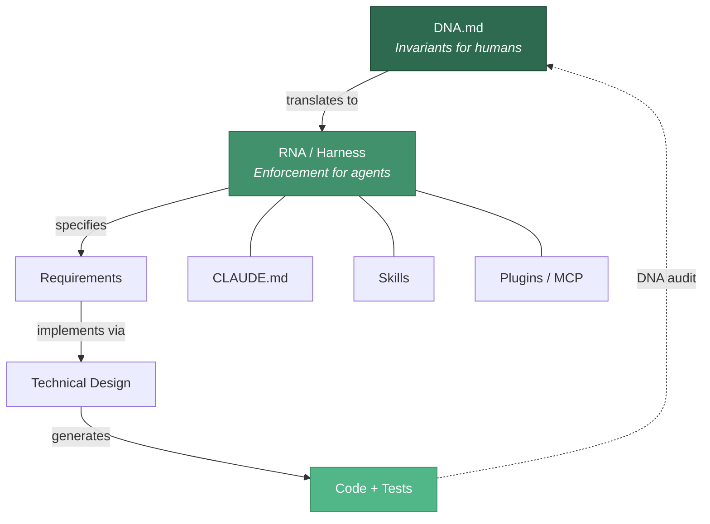
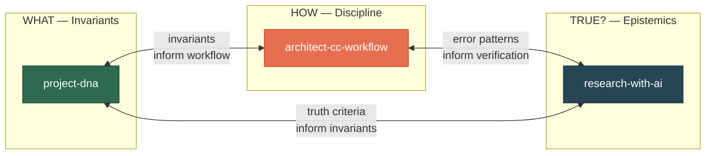
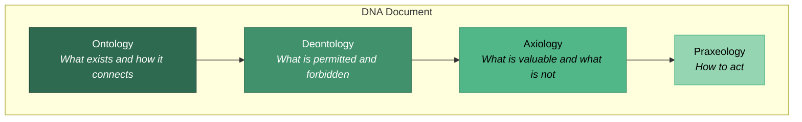
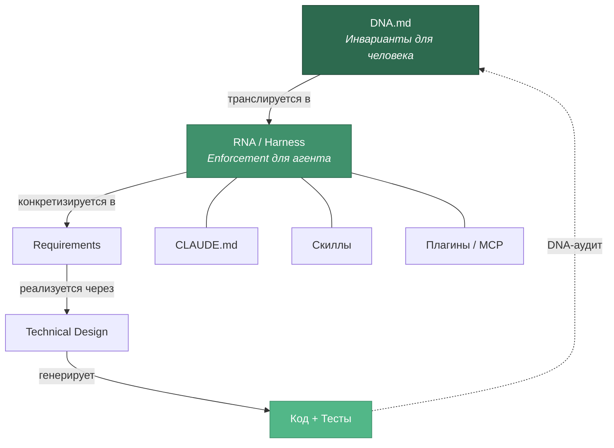
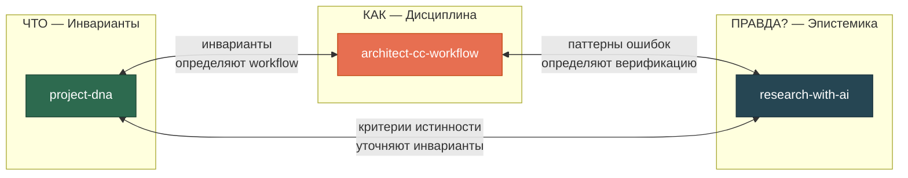
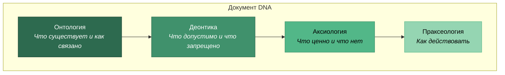

# Project DNA

> **EN** | [RU](#project-dna-ru)

**Root project documents with implementation-independent invariants for AI-assisted development.**

DNA (Decision Nucleic Acid) is a compact document (2-5 pages) capturing only decisions that hold true **regardless of implementation** — no technology names, no frameworks, no models. Just "what" and "why".



## The Problem

When working with AI coding agents, the biggest risk is not bad code — it's **code that solves the wrong problem**. The agent writes excellent code that passes all tests — but the tests check the wrong things because nobody wrote down what actually matters.

DNA prevents this by giving agents a set of **invariants** they must never violate, while leaving implementation decisions flexible.

## Three-Skill Ecosystem

Project DNA works as part of a three-skill system. Each skill covers a different aspect:



| Skill | Domain | Key Question |
|-------|--------|-------------|
| **project-dna** | Invariants | *What can never be violated and why?* |
| **architect-cc-workflow** | Execution discipline | *How to interact with AI agents without errors?* |
| **research-with-ai** | Epistemics | *How do we know this is true?* |

## Quick Start

**New project?** Say: *"Let's create a DNA for this project"*

**Existing project?** Say: *"Extract DNA from this codebase"* or *"Run a DNA audit"*

Full step-by-step guide: **[Quickstart EN](docs/quickstart-en.md)** | **[Quickstart RU](docs/quickstart-ru.md)**

## Five Modes

| Mode | Trigger | What it does |
|------|---------|-------------|
| **Create DNA** | "create DNA", "start project" | Crystallize domain knowledge into a DNA document |
| **DNA Audit** | "DNA audit", "check compliance" | Compare code against DNA invariants, report violations |
| **Extract DNA** | "extract DNA", "what are our invariants" | Reverse-engineer DNA from existing codebase |
| **Mutate DNA** | "update DNA", "this decision changed" | Safely update DNA with versioning and impact analysis |
| **Create RNA** | "create RNA", "create harness" | Translate invariants into stack-specific rules |

Detailed mode descriptions: **[Modes EN](docs/modes-en.md)** | **[Modes RU](docs/modes-ru.md)**

## The Four Layers

DNA is built on four philosophical layers:



## Installation

### Claude Code (plugin)

```bash
claude plugin add SizovOleg/project-dna
```

### Claude Code (manual)

```bash
# All projects (personal)
cp -r skills/project-dna ~/.claude/skills/

# Single project
cp -r skills/project-dna .claude/skills/
```

### Other AI Agents

Copy `skills/project-dna/SKILL.md` to your agent's skills directory. The skill follows the open [Agent Skills](https://agentskills.io) standard.

## Documentation

| Document | EN | RU |
|----------|----|----|
| Quick Start | [quickstart-en.md](docs/quickstart-en.md) | [quickstart-ru.md](docs/quickstart-ru.md) |
| Three-Skill Ecosystem | [ecosystem-en.md](docs/ecosystem-en.md) | [ecosystem-ru.md](docs/ecosystem-ru.md) |
| Five Modes (detailed) | [modes-en.md](docs/modes-en.md) | [modes-ru.md](docs/modes-ru.md) |
| Full Methodology | [methodology-en.md](references/methodology-en.md) | [methodology-ru.md](references/methodology-ru.md) |
| Example DNA | [example-dna.md](examples/example-dna.md) | |
| Example RNA | [example-rna.md](examples/example-rna.md) | |

## License

MIT

---

<a id="project-dna-ru"></a>

# Project DNA (RU)

> [EN](#project-dna) | **RU**

**Корневые документы проекта с инвариантами, независимыми от реализации, для разработки с AI-агентами.**

DNA (Decision Nucleic Acid) — компактный документ (2-5 страниц), содержащий только решения, верные **независимо от реализации**. Без технологий, фреймворков, моделей. Только «что» и «почему».



## Проблема

Главный риск работы с AI-агентами — не плохой код, а **код, который решает не ту задачу**. Агент пишет отличный код, проходящий все тесты — но тесты проверяют не то, потому что никто не записал, что на самом деле важно.

DNA решает эту проблему: даёт агенту набор **инвариантов**, которые нельзя нарушить, оставляя реализацию гибкой.

## Экосистема трёх скиллов

Project DNA работает в связке с двумя другими скиллами:



| Скилл | Домен | Вопрос |
|-------|-------|--------|
| **project-dna** | Инварианты | *Что нельзя нарушить и почему?* |
| **architect-cc-workflow** | Дисциплина исполнения | *Как взаимодействовать с AI без ошибок?* |
| **research-with-ai** | Эпистемика | *Откуда мы знаем, что это правда?* |

## Быстрый старт

**Новый проект?** Скажи: *«Создай DNA для этого проекта»*

**Существующий проект?** Скажи: *«Извлеки DNA из этого кода»* или *«Запусти DNA-аудит»*

Полный пошаговый гайд: **[Quickstart RU](docs/quickstart-ru.md)** | **[Quickstart EN](docs/quickstart-en.md)**

## Пять режимов

| Режим | Триггер | Что делает |
|-------|---------|-----------|
| **Создание DNA** | «создай DNA», «начни проект» | Кристаллизация доменного знания в DNA |
| **DNA-аудит** | «DNA-аудит», «проверь соответствие» | Сравнение кода с инвариантами DNA |
| **Извлечение DNA** | «извлеки DNA», «что у нас за инварианты» | Обратное проектирование DNA из кода |
| **Мутация DNA** | «обнови DNA», «это решение изменилось» | Обновление DNA с версионированием |
| **Создание RNA** | «создай RNA», «создай harness» | Трансляция инвариантов в правила стека |

Подробное описание режимов: **[Modes RU](docs/modes-ru.md)** | **[Modes EN](docs/modes-en.md)**

## Четыре слоя DNA



## Установка

```bash
# Плагин Claude Code
claude plugin add SizovOleg/project-dna

# Вручную — для всех проектов
cp -r skills/project-dna ~/.claude/skills/

# Вручную — для одного проекта
cp -r skills/project-dna .claude/skills/
```

## Документация

| Документ | RU | EN |
|----------|----|----|
| Быстрый старт | [quickstart-ru.md](docs/quickstart-ru.md) | [quickstart-en.md](docs/quickstart-en.md) |
| Экосистема трёх скиллов | [ecosystem-ru.md](docs/ecosystem-ru.md) | [ecosystem-en.md](docs/ecosystem-en.md) |
| Пять режимов (подробно) | [modes-ru.md](docs/modes-ru.md) | [modes-en.md](docs/modes-en.md) |
| Полная методология | [methodology-ru.md](references/methodology-ru.md) | [methodology-en.md](references/methodology-en.md) |
| Пример DNA | [example-dna.md](examples/example-dna.md) | |
| Пример RNA | [example-rna.md](examples/example-rna.md) | |

## Лицензия

MIT
