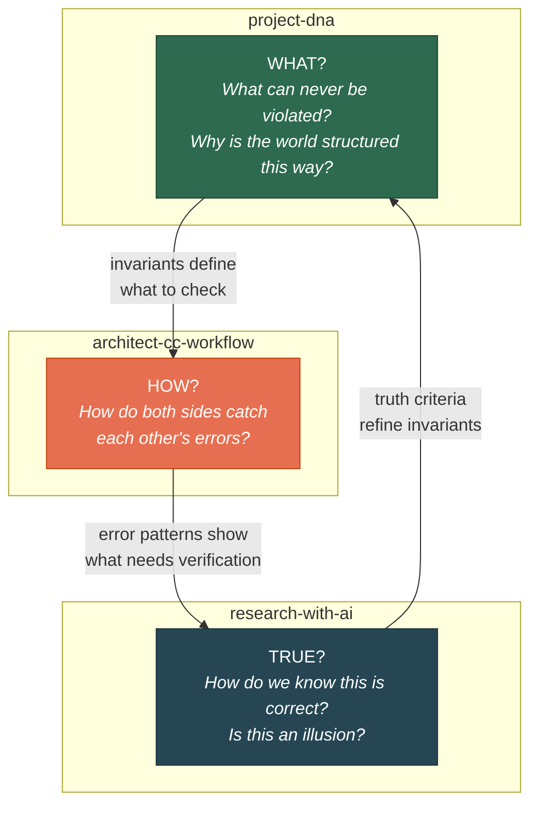
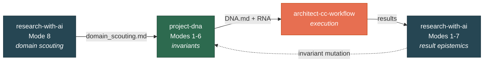
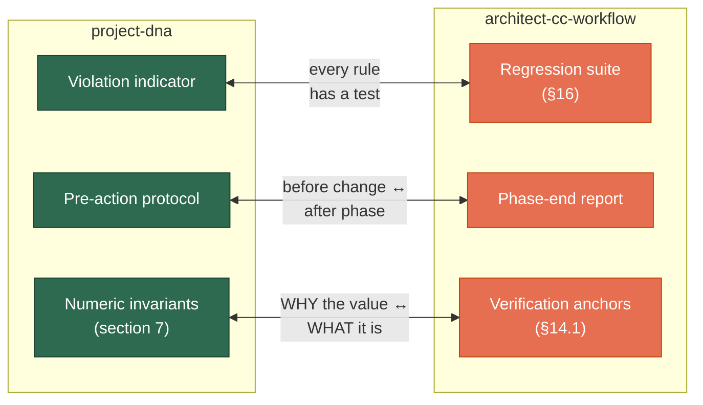
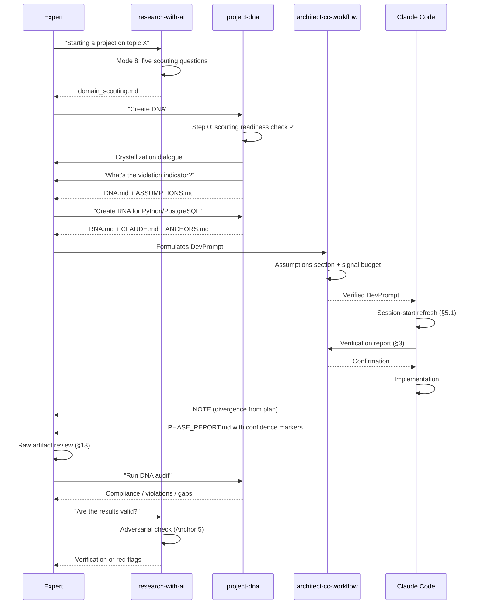
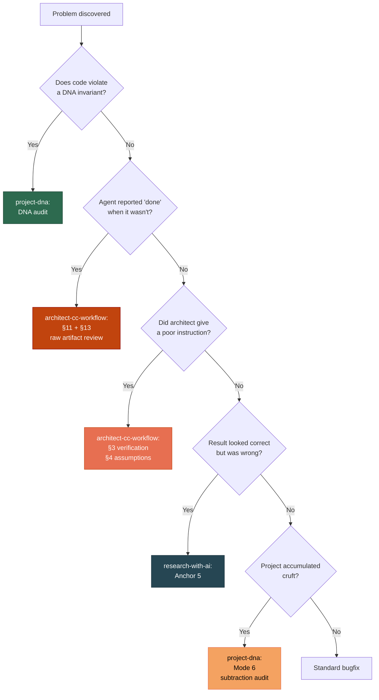

# Three-Skill Ecosystem

[RU version](ecosystem-ru.md)

## Why Three Skills, Not One?

AI-assisted development breaks in three different places:

1. **The agent solves the wrong problem** — doesn't understand what matters in the domain
2. **Both sides make structural errors** — architect and Claude Code alike, each in its own way
3. **The result looks correct but isn't** — pseudo-rigor, beautiful but wrong output

One skill can't cover all three because these are **different types of knowledge**:

## Activation Order

The skills don't fire simultaneously — each owns a phase:

**Key point:** `project-dna` Mode 1 begins with a **scouting readiness check**. If the domain hasn't been scouted, the skill refuses to formulate DNA and routes you to `research-with-ai` Mode 8. This is a gate, not a suggestion.

## Each Skill in Detail

### project-dna — Invariants

**Domain:** What can never be violated and why.

**Six modes:** create DNA, DNA audit, extract, mutate, create RNA, subtraction audit.

**Three key mechanisms:**

| Mechanism | What it solves |
|-----------|---------------|
| **Violation indicator** | An invariant with no observable violation indicator is a slogan. Every invariant must name a concrete code/data state that shows it's broken |
| **ASSUMPTIONS.md** | Separating invariants from hypotheses. Without it, DNA either fossilizes or becomes worthless |
| **Negative invariants** | What must never appear. Protection against accretion drift, which is invisible at the level of any single change |

**Example invariant with violation indicator:**

> "No conclusion is published without a source reference."
> **Violation indicator:** the output artifact contains a record with a non-empty value and an empty provenance field.

True for PostgreSQL, MongoDB, and flat files alike. This is DNA.

---

### architect-cc-workflow — Execution Discipline

**Domain:** How both sides catch each other's structural errors.

**Fundamental change:** the protocol is **bidirectional**. In the architect + Claude Code pair, both sides are LLMs with structural failure modes. The defenses must be symmetric.

#### Architect-side errors (~10% rate)

| Cause | Manifestation |
|-------|--------------|
| No persistent state | Every message is a fresh context; repo state reconstructed from memory |
| Pattern matching from training | Confidently generates plausible-but-wrong assertions |
| Confabulation | Claims knowledge of literature/code without actual verification |

#### Claude Code-side errors — four root causes

| Cause | Manifestation |
|-------|--------------|
| **Likely-not-true generation** | The model generates the statistically probable, not the true. Hence sycophancy, hallucination, and **self-certification of completion** ("task complete" as format continuation, not as fact) |
| **Attention degradation** | Tunnel vision (a rule mid-prompt is ignored) + context drift (by turn 30, rules from the session start are forgotten). Degradation is abrupt, not gradual |
| **Numeric/temporal blindness** | Numbers tokenize as text; there's no symbolic arithmetic. A date is a probability, not a fact |
| **No trust boundary** | The model doesn't distinguish instruction from data. Prompt injection via a poisoned document |

**Core principle:** "there will be no healthy agent." The goal isn't to eliminate errors but to build a **closed loop** (task → action → external check → correction) where errors stay under control.

#### Key Defenses

| Defense | What it prevents |
|---------|-----------------|
| Verification protocol (§3) | Architect issues a spec with unverified constants and assumptions |
| Assumptions section (§4) | Implicit assumptions unwritten; the agent fills gaps |
| Session-start refresh (§5.1) | Agent "remembers" repo state from a prior session — but it's stale |
| Critical rules placement (§5.3) | A rule in the middle of a long context is ignored |
| Probe-first (§8) | Numeric constraints without empirical pre-flight verification |
| **No self-certification (§11)** | Agent declares "done, tests pass" — and the tests never ran |
| **Confidence markers (§12)** | Unclear what was verified programmatically vs pulled from training data |
| **Raw artifact review (§13)** | Architect trusts the summary instead of reading raw output |
| **Numeric hard rule (§14)** | Arithmetic and dates via model reasoning instead of code |
| **BLOCK/NOTE/SILENCE (§15)** | Agent either narrates every step or vanishes for 40 minutes |
| **Regression suite (§16)** | A skill without tests is a set of beliefs about what works |

#### Communication Decision Function (§15)

Not a list of occasions, but a rule derived from cost asymmetry — comparing the cost of the architect learning about it **later** against the cost of interrupting **now**:

|  | On DevPrompt plan | Diverges from plan |
|---|---|---|
| **Reversible** | SILENCE | NOTE |
| **Irreversible, in mandate** | NOTE **before** acting | BLOCK |
| **Irreversible, outside mandate** | BLOCK | BLOCK |

**Signal budget:** ≤1 BLOCK, ≤3-5 NOTE per phase. Exceeding it signals not an agent problem but a **DevPrompt quality** problem: the mandate was underspecified. The architect fixes the DevPrompt, not the agent.

Why this isn't bureaucracy: each unnecessary interruption trains reflexive approval. After a few trivial BLOCKs, a real BLOCK goes unread. Over-asking isn't noise — it's **disarming the mechanism**.

---

### research-with-ai — Epistemics

**Domain:** What counts as truth when working with AI.

**What it does:**
- Establishes an epistemic framework: AI produces work, the human bears responsibility for truth
- Seven anchors of truth — mechanisms compensating specific defects of AI as a research assistant
- Mode 8 — domain scouting, the **mandatory entry point** into project-dna

**Core principle:**
> AI can produce a beautiful, detailed, confident result that is completely wrong. The human's job is not to believe, but to verify.

**Seven anchors:** pre-registration, generator/critic separation, external reproducibility, reality cross-check, adversarial verification, significance calibration, epistemic journal.

---

## How They Interlock

The skills don't merely complement each other — their mechanisms form **pairs**:

| Pair | Shared principle |
|------|-----------------|
| Violation indicator ↔ Regression suite | A rule you can't check observably isn't a rule. In DNA that's the violation indicator; in the skill, the anti-pattern test |
| Pre-action protocol ↔ Phase-end report | Recording decisions on both sides of a change: before (which invariant does this serve) and after (what wasn't verified, which decisions went unapproved) |
| Numeric invariants ↔ Verification anchors | DNA says **why** a quantity is what it is; ANCHORS.md says **what** it concretely is |

## Scenario: New Project from Scratch

## Scenario: Problem Discovered

## When to Use Which Skill

| Situation | Skill | Why |
|-----------|-------|-----|
| Starting a project, domain unfamiliar | **research-with-ai** Mode 8 | DNA without scouting is a declaration |
| Domain scouted, need invariants | **project-dna** Mode 1 | Fix them before coding begins |
| Writing a DevPrompt | **architect-cc-workflow** | Assumptions section + signal budget |
| Agent said "done" | **architect-cc-workflow** §11, §13 | Self-reporting is structurally unreliable |
| Numbers in the report look off | **architect-cc-workflow** §14 | The model treats numbers as text |
| Agent interrupts over trivia | **architect-cc-workflow** §15 | Over-asking disarms BLOCK |
| Code drifted from intent | **project-dna** Mode 2 | DNA audit |
| Project has sprawled | **project-dna** Mode 6 | Subtraction audit |
| Changing stack | **project-dna** Mode 5 | DNA stays, RNA is rewritten |
| "Too good" results | **research-with-ai** Anchor 5 | Sign of pseudo-rigor |
| Changed a skill | **architect-cc-workflow** §16 | A change without a test is incomplete |

## Boundaries: What These Skills Don't Do

- **project-dna** doesn't write code or manage the development process
- **architect-cc-workflow** doesn't define the domain — it takes invariants from DNA
- **research-with-ai** doesn't replace peer review — it strengthens it
- None of these skills replace human domain expertise — they **amplify** it

## Origin

Extracted from the practice of developing SciProof and sat-revisit-tool (2025-2026). Key patterns emerged across 50+ Claude Code sessions: unit tests passed but integration broke; the architect made ~10% errors due to LLM structural limits; the agent reported completion by format rather than by fact; results looked rigorous but were incorrect.
