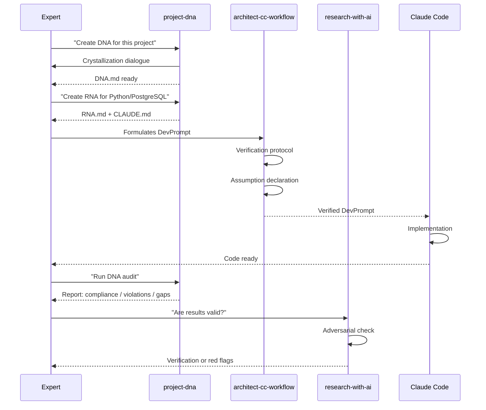
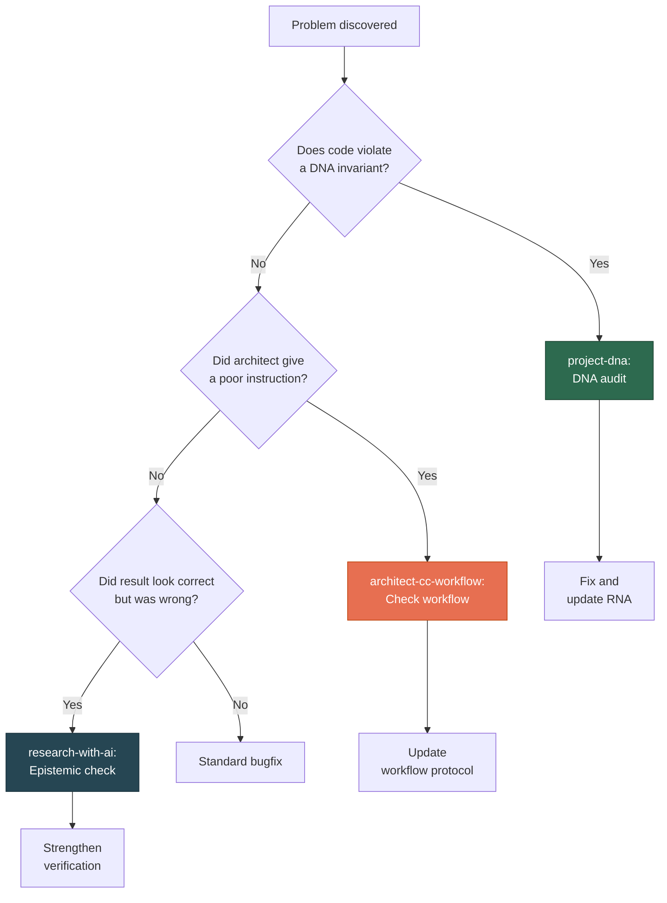

# Three-Skill Ecosystem

[RU version](ecosystem-ru.md)

## Why Three Skills, Not One?

AI-assisted development breaks in three different places:

1. **The agent solves the wrong problem** — doesn't understand what matters in the domain
2. **The architect (human) gives poor instructions** — misformulated tasks, implicit assumptions
3. **The result looks correct but isn't** — pseudo-rigor, beautiful but wrong output

One skill can't cover all three because these are **different types of knowledge**:

## Each Skill in Detail

### project-dna — Invariants

**Domain:** What can never be violated and why.

**What it does:**
- Creates DNA — a compact document (2-5 pages) with implementation-independent decisions
- Runs DNA audits — checks whether code has drifted from invariants
- Extracts DNA from existing codebases
- Mutates DNA when domain understanding changes
- Creates RNA — enforcement rules for a specific stack/agent

**Example invariant:**
> "Fact and Claim are different entities. One fact can have multiple contradictory claims from different authors."

This is true for PostgreSQL, MongoDB, and flat files alike. This is DNA.

---

### architect-cc-workflow — Execution Discipline

**Domain:** How to interact with AI agents without errors.

**What it does:**
- Codifies the workflow for the "architect (Claude.ai) + Claude Code" pair
- Protects against ~10% architect error rate (LLM errors in task formulation)
- Provides verification protocol, probe-first approach, assumption declaration

**Key protections:**

| Protection | What it prevents |
|-----------|-----------------|
| Verification protocol | Agent writes code but doesn't check if it actually works |
| Probe-first | Architect assigns tasks without studying current code state |
| Assumption declaration | Implicit architect assumptions unwritten, agent fills gaps |
| State refresh | Architect works with outdated picture of the project |
| Hard iteration limits | Agent endlessly debugs the same approach |

---

### research-with-ai — Epistemics

**Domain:** What counts as truth when working with AI.

**What it does:**
- Establishes an epistemic framework: AI produces work, human bears responsibility for truth
- Protects against pseudo-rigor — results that look scientific but are incorrect
- Provides adversarial verification, pre-registration, reproducibility

**Core principle:**
> AI can produce a beautiful, detailed, confident result that is completely wrong. The human's job is not to believe, but to verify.

---

## How They Work Together

### Scenario: New Project from Scratch

### Scenario: Problem Discovered in Production

## When to Use Which Skill

| Situation | Skill | Why |
|-----------|-------|-----|
| Starting a new project | **project-dna** | Need to fix invariants before coding begins |
| Writing a DevPrompt for Claude Code | **architect-cc-workflow** | Need discipline in task formulation |
| Code works but result is suspicious | **research-with-ai** | Need epistemic verification |
| Changing stack (Python to Go) | **project-dna** | DNA stays, RNA is rewritten |
| Agent endlessly debugging | **architect-cc-workflow** | Hard iteration limit violated |
| "Too good" results | **research-with-ai** | Sign of pseudo-rigor |
| Code drifted from intent | **project-dna** | Need DNA audit |
| New team member onboarding | **project-dna** + **architect-cc-workflow** | DNA for understanding, workflow for discipline |

## Boundaries: What These Skills Don't Do

- **project-dna** doesn't write code or manage the development process
- **architect-cc-workflow** doesn't define the domain — it takes invariants from DNA
- **research-with-ai** doesn't replace peer review — it strengthens it
- None of these skills replace human domain expertise — they **amplify** it

## Origin

All three skills were extracted from the practice of developing SciProof (2025-2026) — a scientific verification platform for geomorphological publications. Key patterns were discovered across 50+ Claude Code sessions where unit tests passed but integration broke; where the architect made ~10% errors due to LLM structural limits; where results looked rigorous but were incorrect.
