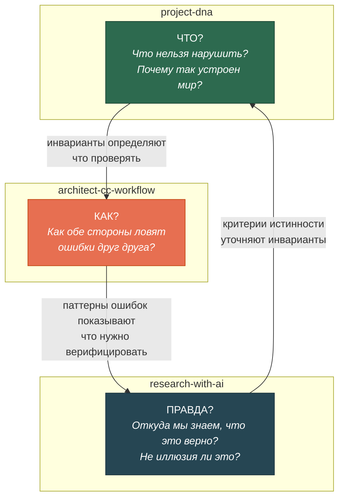
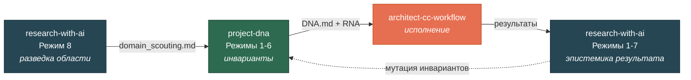
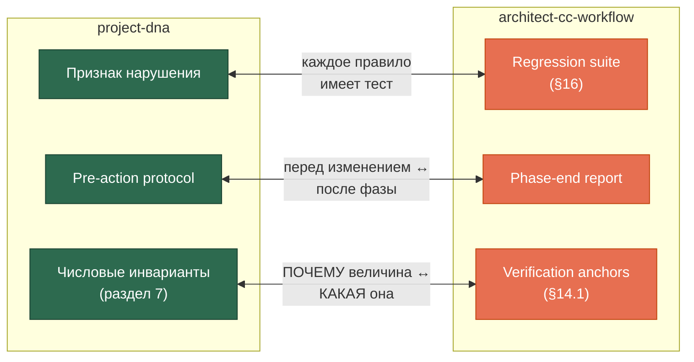
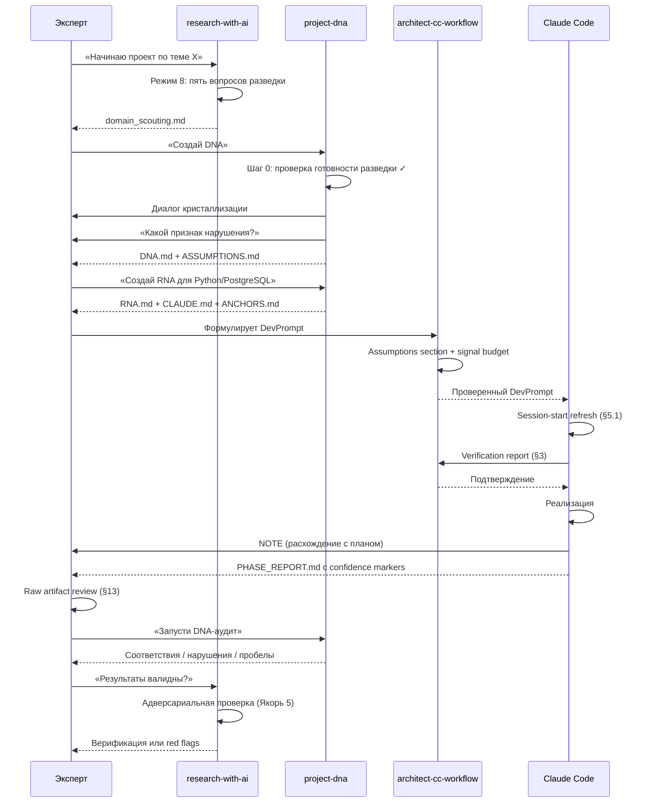
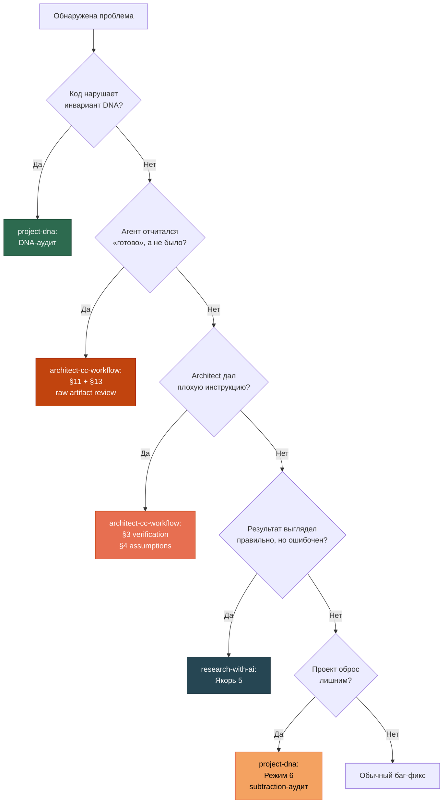

# Экосистема трёх скиллов

[EN version](ecosystem-en.md)

## Зачем три скилла, а не один?

Разработка с AI-агентами ломается в трёх разных местах:

1. **Агент решает не ту задачу** — не понимает, что важно в предметной области
2. **Обе стороны допускают структурные ошибки** — и architect, и Claude Code, каждый по-своему
3. **Результат выглядит правильно, но неверен** — псевдострогость, красивый но неправильный вывод

Один скилл не может закрыть все три проблемы, потому что это **разные типы знания**:

## Порядок включения

Скиллы включаются не одновременно, а последовательно — каждый на своей фазе:

**Ключевое:** `project-dna` Режим 1 начинается с **проверки готовности разведки**. Если предметная область не разведана — скилл отказывается формулировать DNA и направляет в `research-with-ai` Режим 8. Это не рекомендация, а gate.

## Каждый скилл — подробно

### project-dna — Инварианты

**Домен:** Что нельзя нарушить и почему.

**Шесть режимов:** создание DNA, DNA-аудит, извлечение, мутация, создание RNA, subtraction-аудит.

**Три ключевых механизма:**

| Механизм | Что решает |
|----------|-----------|
| **Признак нарушения** | Инвариант без наблюдаемого признака нарушения — лозунг. Каждый инвариант обязан указывать конкретное состояние кода/данных, показывающее нарушение |
| **ASSUMPTIONS.md** | Разделение инвариантов и гипотез. Без него DNA либо окаменевает, либо обесценивается |
| **Негативные инварианты** | Что НЕ должно появиться. Защита от accretion-дрейфа, который невозможно заметить на уровне одного изменения |

**Пример инварианта с признаком нарушения:**

> «Ни один вывод не публикуется без указания источника.»
> **Признак нарушения:** в выходном артефакте есть запись с непустым значением и пустым полем провенанса.

Это верно и для PostgreSQL, и для MongoDB, и для текстовых файлов. Это DNA.

---

### architect-cc-workflow — Дисциплина исполнения

**Домен:** Как обе стороны ловят структурные ошибки друг друга.

**Принципиальное изменение:** протокол **двунаправленный**. В паре architect + Claude Code обе стороны — LLM со структурными failure modes. Защиты нужны симметричные.

#### Architect-side ошибки (~10% rate)

| Причина | Проявление |
|---------|-----------|
| No persistent state | Каждое сообщение — свежий контекст, состояние репо реконструируется по памяти |
| Pattern matching from training | Уверенно генерирует правдоподобные, но неверные утверждения |
| Confabulation | Заявляет знание литературы/кода без реальной проверки |

#### Claude Code-side ошибки — четыре корневые причины

| Причина | Проявление |
|---------|-----------|
| **Likely-not-true generation** | Модель генерирует статистически вероятное, не истинное. Отсюда подхалимство, галлюцинации и **самоотчёт о завершении** («task complete» как продолжение по формату, а не как факт) |
| **Attention degradation** | Туннельное зрение (правило в середине промпта игнорируется) + дрейф контекста (к 30-му ходу правила из начала забыты). Деградация резкая, не плавная |
| **Numeric/temporal blindness** | Числа токенизируются как текст, символьного исчисления нет. Дата — вероятность, не факт |
| **No trust boundary** | Модель не различает инструкцию и данные. Prompt injection через заражённый документ |

**Ключевой принцип:** «здорового агента не будет». Цель не устранить ошибки, а построить **замкнутый контур** (задача → действие → внешняя проверка → корректировка), где ошибки под контролем.

#### Ключевые защиты

| Защита | От чего спасает |
|--------|----------------|
| Verification protocol (§3) | Architect даёт спеку с непроверенными константами и допущениями |
| Assumptions section (§4) | Неявные допущения не прописаны, агент додумывает |
| Session-start refresh (§5.1) | Агент «помнит» состояние репо из прошлой сессии — но оно устарело |
| Critical rules placement (§5.3) | Правило в середине длинного контекста игнорируется |
| Probe-first (§8) | Числовые ограничения без эмпирической проверки |
| **No self-certification (§11)** | Агент объявляет «готово, тесты прошли» — а тесты не запускались |
| **Confidence markers (§12)** | Непонятно, что проверено программно, а что взято из training data |
| **Raw artifact review (§13)** | Architect верит пересказу вместо чтения сырого вывода |
| **Numeric hard rule (§14)** | Арифметика и даты через reasoning модели вместо кода |
| **BLOCK/NOTE/SILENCE (§15)** | Агент либо нарративит каждый шаг, либо исчезает на 40 минут |
| **Regression suite (§16)** | Skill без тестов — набор убеждений о том, что работает |

#### Решающая функция коммуникации (§15)

Не список поводов, а правило, выводимое из асимметрии стоимостей — сравнивается стоимость того, что architect узнает **позже**, со стоимостью прерывания **сейчас**:

|  | По плану DevPrompt | Расхождение с планом |
|---|---|---|
| **Обратимо** | SILENCE | NOTE |
| **Необратимо, в мандате** | NOTE **перед** действием | BLOCK |
| **Необратимо, вне мандата** | BLOCK | BLOCK |

**Signal budget:** ≤1 BLOCK, ≤3-5 NOTE на фазу. Превышение — сигнал не об агенте, а о **качестве DevPrompt**: мандат недоспецифицирован. Architect чинит DevPrompt, не агента.

Почему это не формальность: каждое лишнее прерывание обучает одобрять рефлекторно. После нескольких тривиальных BLOCK настоящий BLOCK проходит непрочитанным. Over-asking — не шум, а **обезоруживание механизма**.

---

### research-with-ai — Эпистемика

**Домен:** Что считать истиной при работе с AI.

**Что делает:**
- Устанавливает эпистемическую рамку: AI производит работу, человек отвечает за истинность
- Семь якорей истины — механизмы, компенсирующие конкретные дефекты AI как исследовательского ассистента
- Режим 8 — разведка предметной области, **обязательный вход** в project-dna

**Ключевой принцип:**
> AI может произвести красивый, детальный, уверенный результат, который полностью неверен. Задача человека — не поверить, а проверить.

**Семь якорей:** предрегистрация, разделение генератора и критика, внешняя воспроизводимость, сверка с реальностью, адверсариальная проверка, калибровка значимости, эпистемический журнал.

---

## Как они стыкуются

Скиллы не просто дополняют друг друга — их механизмы образуют **пары**:

| Пара | Общий принцип |
|------|--------------|
| Признак нарушения ↔ Regression suite | Правило, которое нельзя проверить наблюдаемо, — не правило. В DNA это признак нарушения, в скилле — тест на анти-паттерн |
| Pre-action protocol ↔ Phase-end report | Фиксация решений с двух сторон изменения: перед (какому инварианту соответствует) и после (что не проверено, какие решения без согласования) |
| Числовые инварианты ↔ Verification anchors | DNA говорит **почему** величина такая, ANCHORS.md — **какая** она конкретно |

## Сценарий: новый проект с нуля

## Сценарий: обнаружена проблема

## Когда какой скилл

| Ситуация | Скилл | Почему |
|----------|-------|--------|
| Начинаю проект, область незнакома | **research-with-ai** Режим 8 | DNA без разведки — декларация |
| Область разведана, нужны инварианты | **project-dna** Режим 1 | Зафиксировать до начала кодирования |
| Пишу DevPrompt | **architect-cc-workflow** | Assumptions section + signal budget |
| Агент сказал «готово» | **architect-cc-workflow** §11, §13 | Самоотчёт структурно ненадёжен |
| Числа в отчёте вызывают сомнение | **architect-cc-workflow** §14 | Модель оперирует числами как текстом |
| Агент прерывает по мелочам | **architect-cc-workflow** §15 | Over-asking обезоруживает BLOCK |
| Код отклонился от замысла | **project-dna** Режим 2 | DNA-аудит |
| Проект разросся | **project-dna** Режим 6 | Subtraction-аудит |
| Меняю стек | **project-dna** Режим 5 | DNA остаётся, RNA переписывается |
| «Слишком хорошие» результаты | **research-with-ai** Якорь 5 | Признак псевдострогости |
| Изменил скилл | **architect-cc-workflow** §16 | Изменение без теста — незавершённое |

## Границы: что НЕ делают эти скиллы

- **project-dna** не пишет код и не управляет процессом разработки
- **architect-cc-workflow** не определяет предметную область — берёт инварианты из DNA
- **research-with-ai** не заменяет peer review — усиливает его
- Ни один скилл не заменяет доменную экспертизу человека — они **усиливают** её

## Происхождение

Скиллы извлечены из практики разработки SciProof и sat-revisit-tool (2025-2026). Ключевые паттерны обнаружены за 50+ сессий Claude Code: юнит-тесты проходили, а интеграция ломалась; architect допускал ~10% ошибок из-за LLM structural limits; агент отчитывался о завершении по формату, а не по факту; результаты выглядели строго, но были некорректны.
