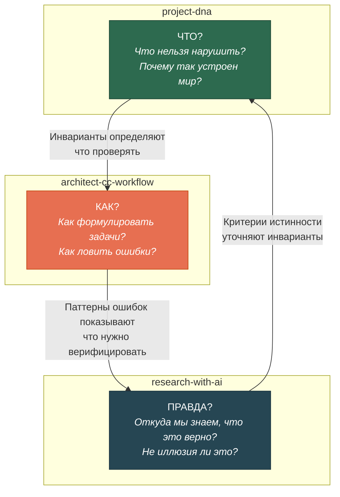
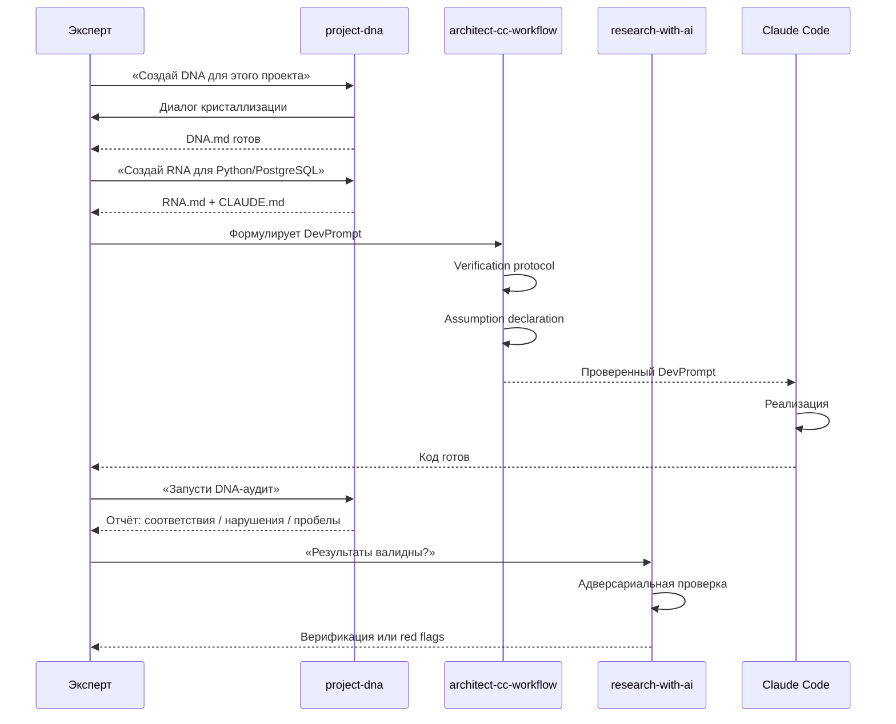
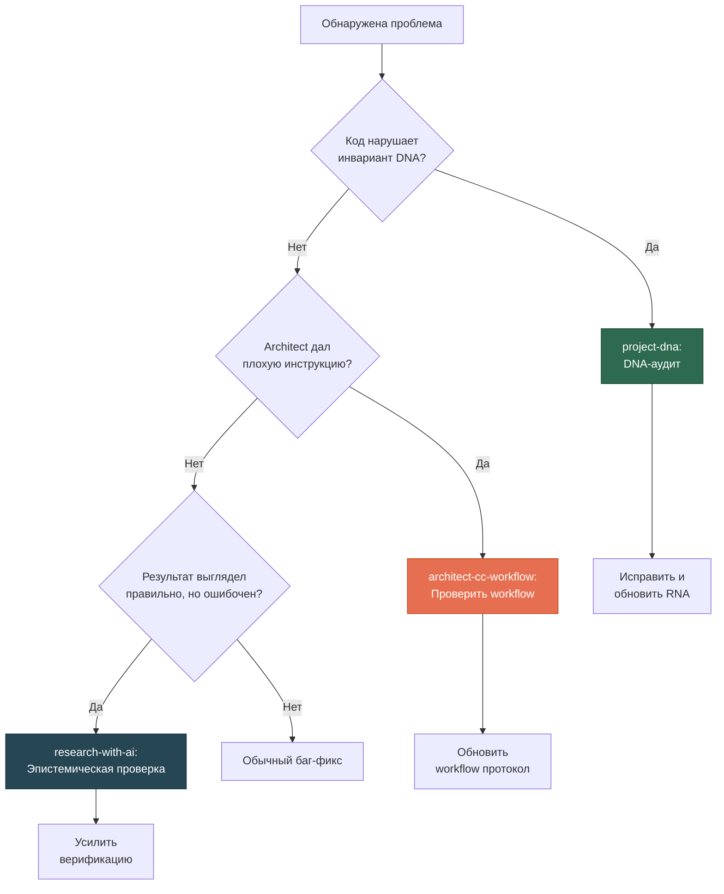

# Экосистема трёх скиллов

[EN version](ecosystem-en.md)

## Зачем три скилла, а не один?

Разработка с AI-агентами ломается в трёх разных местах:

1. **Агент решает не ту задачу** — не понимает, что важно в предметной области
2. **Architect (человек) даёт плохие инструкции** — ошибки формулировки, неявные допущения
3. **Результат выглядит правильно, но неверен** — псевдострогость, красивый но неправильный вывод

Один скилл не может закрыть все три проблемы, потому что это **разные типы знания**:

## Каждый скилл — подробно

### project-dna — Инварианты

**Домен:** Что нельзя нарушить и почему.

**Что делает:**
- Создаёт DNA — компактный документ (2-5 стр.) с решениями, независимыми от реализации
- Проводит DNA-аудит — проверяет, не отклонился ли код от инвариантов
- Извлекает DNA из существующего кода
- Мутирует DNA при изменении понимания предметной области
- Создаёт RNA — правила для конкретного стека/агента

**Пример инварианта:**
> «Факт и Утверждение — разные сущности. Один факт может иметь несколько противоречивых утверждений от разных авторов.»

Это верно и для PostgreSQL, и для MongoDB, и для текстовых файлов. Это DNA.

**Наши уроки сюда НЕ относятся** — DNA про предметную область, не про процесс.

---

### architect-cc-workflow — Дисциплина исполнения

**Домен:** Как взаимодействовать с AI-агентами без ошибок.

**Что делает:**
- Кодифицирует workflow для пары «architect (Claude.ai) + Claude Code»
- Защищает от ~10% architect error rate (ошибки LLM при формулировке задач)
- Обеспечивает verification protocol, probe-first подход, assumption declaration

**Ключевые защиты:**

| Защита | От чего спасает |
|--------|----------------|
| Verification protocol | Агент пишет код, но не проверяет — работает ли он? |
| Probe-first | Architect даёт задачу, не изучив текущее состояние кода |
| Assumption declaration | Неявные допущения architect не прописаны, агент додумывает |
| State refresh | Architect работает с устаревшей картиной проекта |
| Hard iteration limits | Агент бесконечно дебажит один и тот же подход |

**Наши уроки сюда — уже внесены.** Этот скилл напрямую извлечён из опыта 50+ сессий.

---

### research-with-ai — Эпистемика

**Домен:** Что считать истиной при работе с AI.

**Что делает:**
- Устанавливает эпистемическую рамку: AI производит работу, человек отвечает за истинность
- Защищает от псевдострогости — результат выглядит научно, но неверен
- Обеспечивает адверсариальную проверку, предрегистрацию, воспроизводимость

**Ключевой принцип:**
> AI может произвести красивый, детальный, уверенный результат, который полностью неверен. Задача человека — не поверить, а проверить.

**Cross-ref:** §12 скилла содержит перекрёстные ссылки на project-dna и architect-cc-workflow.

---

## Как они работают вместе

### Сценарий: Новый проект с нуля

### Сценарий: Обнаружена проблема в продакшене

## Когда какой скилл использовать

| Ситуация | Скилл | Почему |
|----------|-------|--------|
| Начинаю новый проект | **project-dna** | Нужно зафиксировать инварианты до начала кодирования |
| Пишу DevPrompt для Claude Code | **architect-cc-workflow** | Нужна дисциплина формулировки задач |
| Код работает, но результат подозрительный | **research-with-ai** | Нужна эпистемическая проверка |
| Меняю стек (Python → Go) | **project-dna** | DNA остаётся, RNA переписывается |
| Агент бесконечно дебажит | **architect-cc-workflow** | Нарушен hard iteration limit |
| «Слишком хорошие» результаты | **research-with-ai** | Признак псевдострогости |
| Код отклонился от замысла | **project-dna** | Нужен DNA-аудит |
| Новый член команды подключается | **project-dna** + **architect-cc-workflow** | DNA для понимания, workflow для дисциплины |

## Границы: что НЕ делают эти скиллы

- **project-dna** не пишет код и не управляет процессом разработки
- **architect-cc-workflow** не определяет предметную область — он берёт инварианты из DNA
- **research-with-ai** не заменяет peer review — он усиливает его
- Ни один скилл не заменяет доменную экспертизу человека — они **усиливают** её

## Происхождение

Все три скилла извлечены из практики разработки SciProof (2025-2026) — платформы научной верификации для геоморфологических публикаций. Ключевые паттерны обнаружены за 50+ сессий Claude Code, где юнит-тесты проходили, а интеграция ломалась; где architect допускал ~10% ошибок из-за LLM structural limits; где результаты выглядели строго, но были некорректны.
