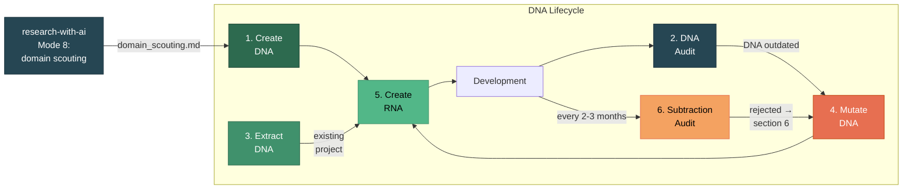
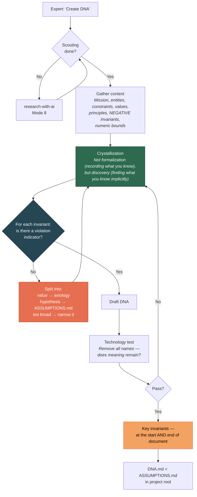
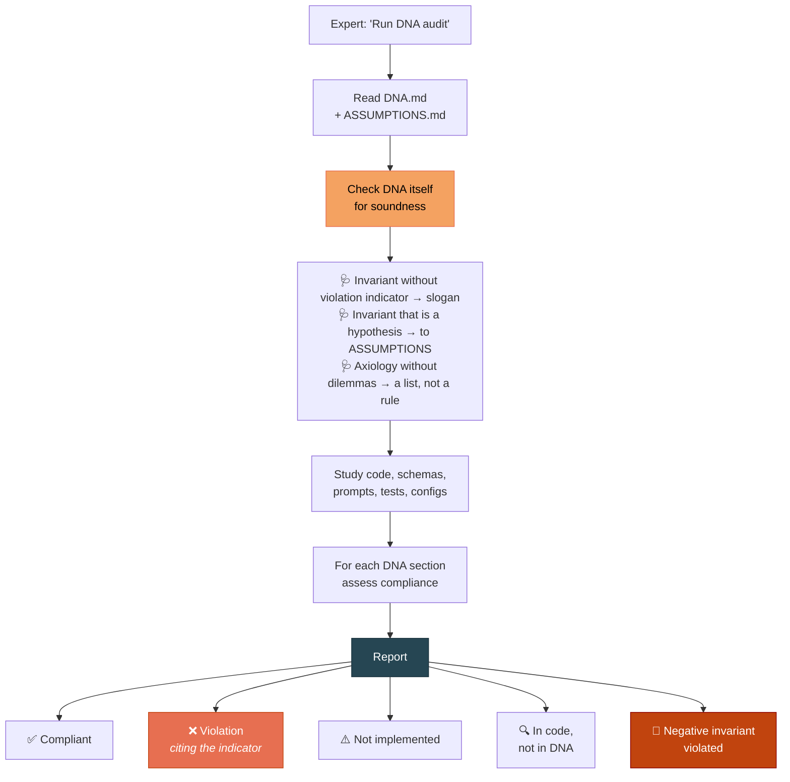
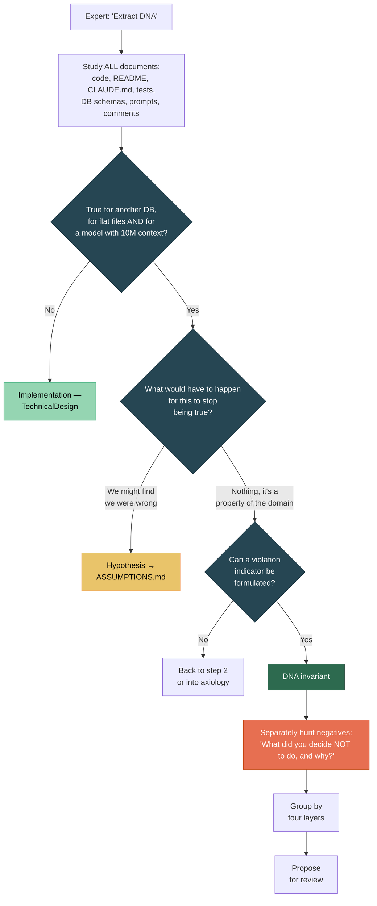
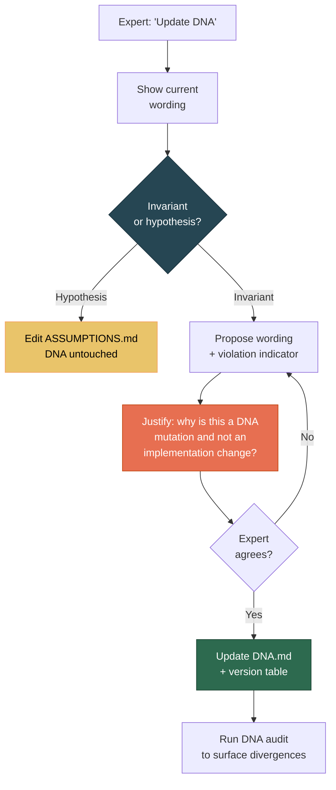
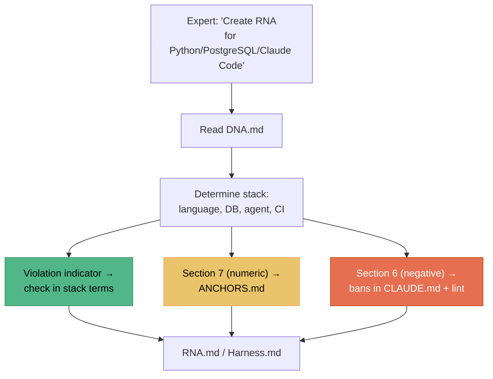
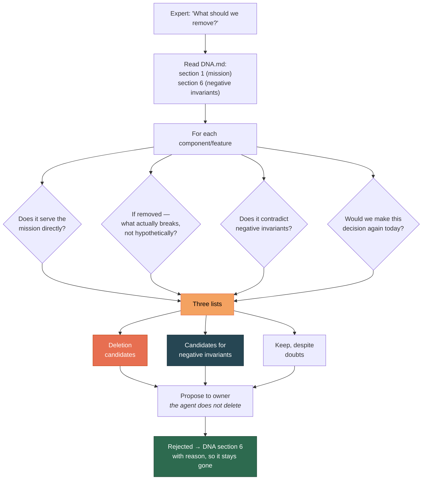
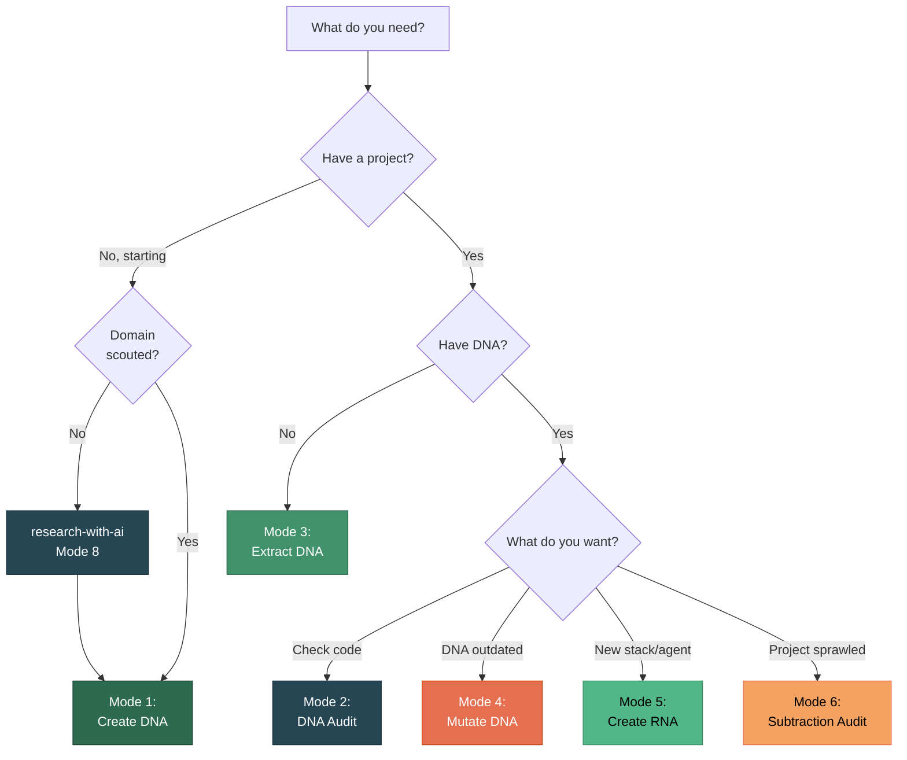

# Six Operating Modes

[RU version](modes-ru.md)

Project DNA has six modes. Each handles a different task in the project lifecycle.



---

## Mode 1: Create DNA

**When:** Starting a new project.

**Triggers:** *"create DNA"*, *"start project"*, *"let's begin"*

### Step 0: Domain Scouting Readiness Check (mandatory)

DNA without domain scouting is a declarative document resting on the plausibility of AI phrasing or the authority of someone else's sources — not on justified premises.

Before formulating DNA — five control questions:

| Question | Readiness criterion |
|----------|--------------------|
| **Ontological** | Can you map the domain entities against 3+ independent precedents? |
| **Precedent** | Do you know 3-5 analogous projects, including at least one failed, and their actual failure modes? |
| **Categorical** | Have you identified where AI will wrongly transfer categories from training data? |
| **Conflict** | Do you know the real axiological dilemmas in this area and how they were resolved? |
| **Boundary** | Can you separate the project's object from adjacent ones with concrete criteria? |

Any answer of "not sure" → **do not proceed to step 1**. Go to `research-with-ai`, Mode 8.

### How It Works



### Why Key Invariants Are Duplicated

A rule sitting in the middle of a long context is statistically ignored by the agent. This is a property of attention architecture, not model laziness. So key invariants go at the **start** of the document and are duplicated at the **end**.

Details: `architect-cc-workflow` §5.3.

### Example Dialogue

```
You: Create DNA for a sedimentary rock analysis project.

AI: First let's check scouting readiness. Can you map the domain
    entities against 3+ independent precedents?

You: Yes — three papers on grain morphometry, two of them with
    different classification approaches.

AI: [...four remaining questions...]
    Good, scouting is sufficient. Let's start with the mission.

You: We analyze grains in thin sections — size, shape, roundness.
    Automating what geologists do manually.

AI: Clarifications:
    1. Roundness and Circularity — different parameters or synonyms?
    2. Training dataset — one-time resource or permanent asset?

You: Roundness and Circularity are strictly different!

AI: That's an invariant. What's the violation indicator? What would
    I see in code or data if it were broken?

You: If one column holds values of both parameters, or if one is
    computed from the other.
```

**Two key moments:** the Roundness/Circularity question is crystallization (the expert knew but hadn't articulated). The violation indicator question turns a phrase into a checkable condition.

---

## Mode 2: DNA Audit

**When:** Checking whether code has drifted from invariants.

**Triggers:** *"DNA audit"*, *"check compliance"*

**Regular triggers** (not only on request): phase completion, stack change, returning after a pause > 1 month, before publication or handoff.

### How It Works



### Checking DNA Itself — Before Checking Code

New compared to earlier versions: the audit starts by diagnosing the **quality of the DNA itself**, not the code. There's no point checking code against slogans.

```
🩺 Invariant quality:
- "The system must be reliable" — slogan with no violation
  indicator, needs reformulation
- "Library X doesn't support Y" — hypothesis,
  move to ASSUMPTIONS.md
- Section 4 lists values without resolved dilemmas —
  an agent cannot apply a list
```

### What the Audit Produces

Diagnostics only, **no fix proposals**:

```
## DNA Audit: SciProof

### Ontology
✅ Fact ≠ Claim — implemented (tables facts, claims)
❌ Measurement ≠ Interpretation — merged into one model
   Violation indicator (DNA §3.2): one table holds both measured
   and interpreted values → confirmed

### Negative Invariants
🚫 DNA §6.3 forbids ORM abstractions over SQL —
   core/repository.py grew an ORM-like layer

### Require Manual Verification
- Correctness of ontological distinctions
```

---

## Mode 3: Extract DNA

**When:** The project exists, DNA doesn't.

**Triggers:** *"extract DNA"*, *"what are our invariants"*

### How It Works



### Negative Invariants Are Almost Never Written Down

But they live in the decisions: what the team rejected, why something isn't automated, which dependencies are banned. You have to ask directly: **"What did you decide NOT to do, and why?"**

---

## Mode 4: Mutate DNA

**When:** Domain understanding has changed.

**Triggers:** *"update DNA"*, *"this decision is outdated"*

### How It Works



### Important Rule

The agent **proposes** a mutation but **does not commit** without expert consent. DNA is updated only by the project owner.

The first branch is new: a significant share of "update DNA" requests actually concern hypotheses. Those are edited in `ASSUMPTIONS.md`, leaving DNA untouched.

---

## Mode 5: Create RNA

**When:** DNA is ready, you need enforcement rules for the stack.

**Triggers:** *"create RNA"*, *"create harness"*

### How It Works



### The Violation Indicator *Is* the Check Specification

An invariant without a violation indicator is **untranslatable into RNA**. That's another reason to demand one at DNA creation time.

| DNA | Violation indicator | RNA (Python/PostgreSQL) |
|-----|--------------------|------------------------|
| "Fact ≠ Claim" | One table holds both types | Models `Fact` and `Claim` separate. Test: `test_fact_claim_separation()` |
| "Originals immutable" | An UPDATE path to originals exists | SQL trigger `BEFORE UPDATE RAISE EXCEPTION` |
| "Traceability" | Record with non-empty value and empty provenance | `source_ref NOT NULL`. CI: `SELECT count(*) WHERE source_ref IS NULL = 0` |

### Numeric Invariants → ANCHORS.md

DNA section 7 (numeric domain invariants) generates `ANCHORS.md` — a set of self-check anchors for the agent.

**Division of responsibility:** DNA says **why** a quantity is what it is; `ANCHORS.md` and the constants file say **what** it concretely is.

Details: `architect-cc-workflow` §14.1.

---

## Mode 6: Subtraction Audit

**When:** Regularly (every 2-3 months) for active projects.

**Triggers:** *"what to remove"*, *"the project has sprawled"*, *"let's clean up"*

### Why

Projects sprawl through **accretion**: each addition looks reasonable, the sum destroys coherence. The default working mode is to add. The subtraction audit is deliberate counter-pressure.

Adding features can turn a tool into the very thing it was built against. Deleting half the roadmap is sometimes the best product decision available.

### How It Works



### What the Audit Produces

```
### Deletion Candidates
- XML export — doesn't serve the mission, added for a single
  one-off request. Frees 340 LOC + the lxml dependency

### Candidates for Negative Invariants
- Automatic interpretation of results — rejected twice this
  year. Record in section 6 so it stops coming back

### Keep, Despite Doubts
- CLI interface — looks like duplication of the web UI, but it's
  the only path for batch processing
```

**Important:** the agent does not delete. Deletion is the owner's decision, like DNA mutation.

---

## Which Mode Do I Need?


