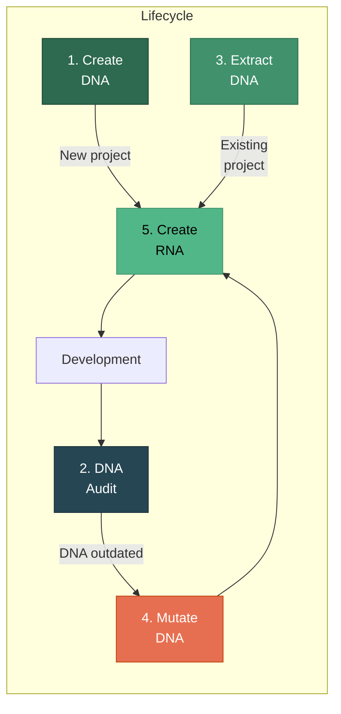
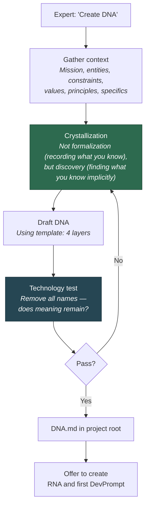
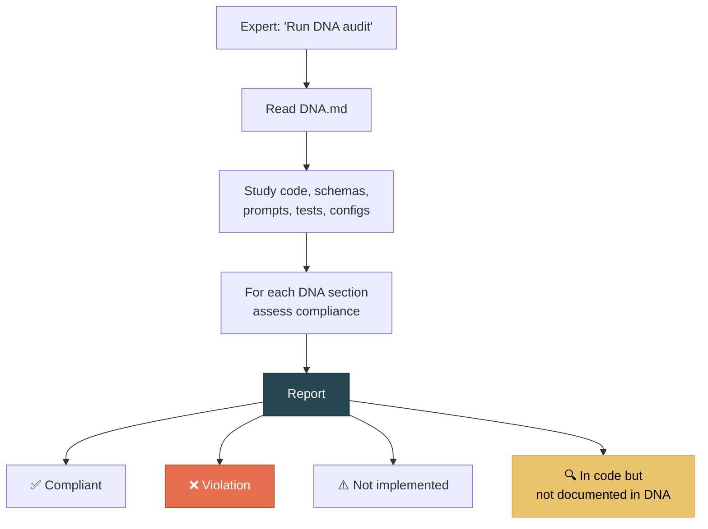
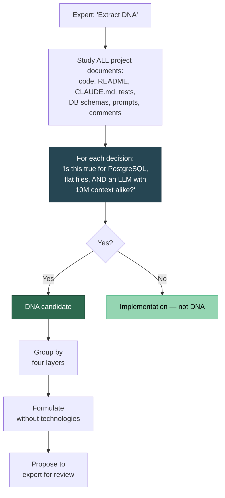
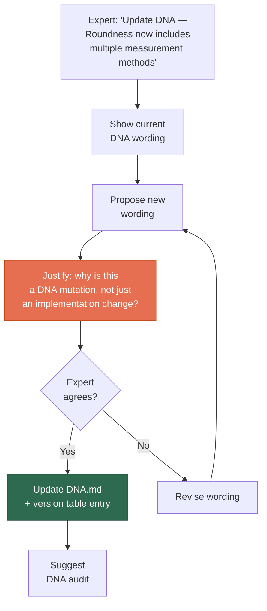
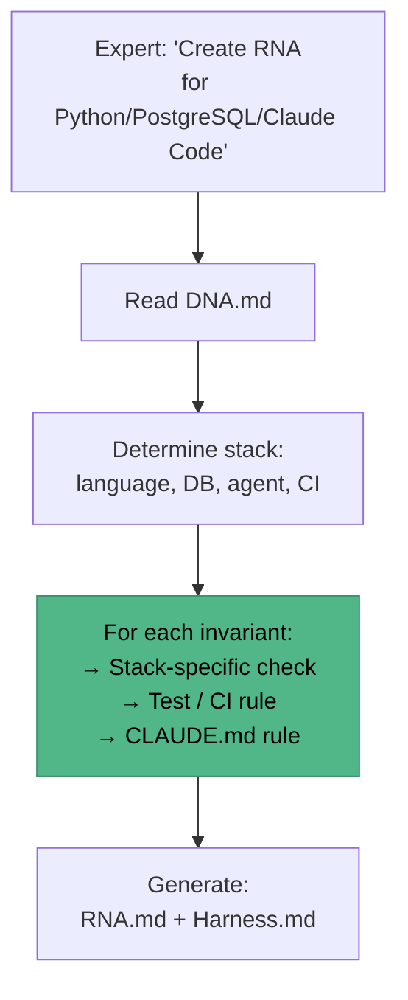
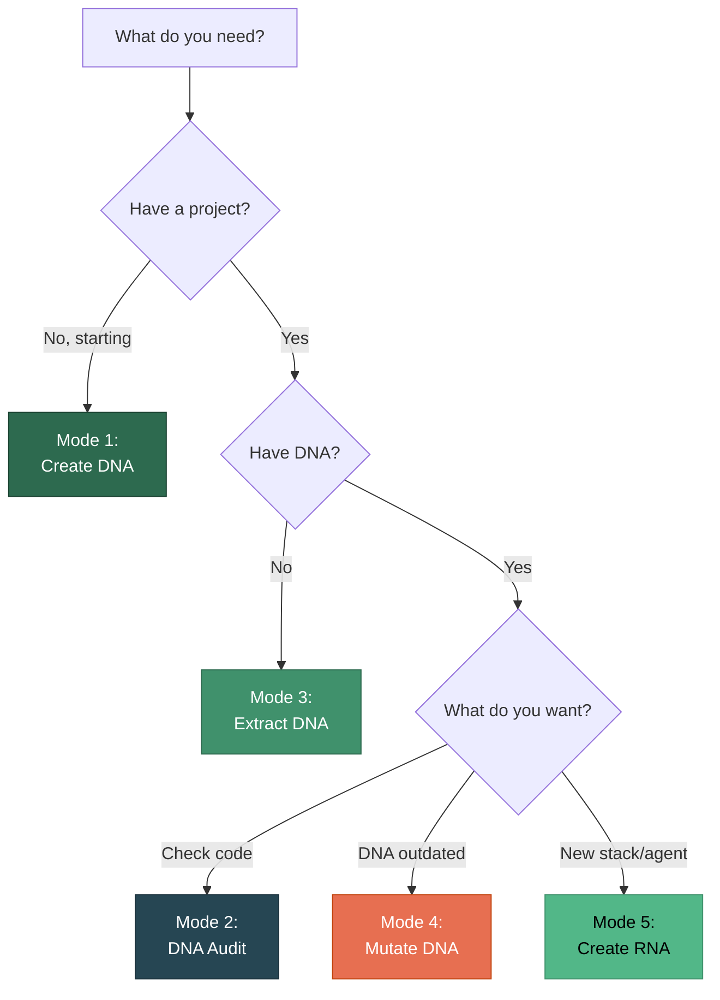

# Five Operating Modes

[RU version](modes-ru.md)

Project DNA has five modes. Each handles a different task in the project lifecycle.



---

## Mode 1: Create DNA

**When:** Starting a new project.

**Triggers:** *"create DNA"*, *"start project"*, *"let's begin"*

### How It Works



### Example Dialogue

```
You: Create DNA for a sedimentary rock analysis project.

AI: Let's start with the mission. Why does this system exist?

You: We analyze grains in thin sections — their size, shape, 
     roundness. We need to automate what geologists do 
     manually under a microscope.

AI: Got it. A few clarifications:
    1. Roundness and Circularity — are these different 
       parameters or synonyms?
    2. Training dataset — is this a one-time resource 
       or a permanent asset?
    3. What's more important — processing speed or 
       classification accuracy?

You: Roundness and Circularity are strictly different things! 
     You must never confuse them...
```

**Key moment:** The Roundness/Circularity question is crystallization. The expert knew they were different but hadn't formulated it as an invariant until the AI asked.

---

## Mode 2: DNA Audit

**When:** You want to check whether code has drifted from invariants.

**Triggers:** *"DNA audit"*, *"check compliance"*, *"what are our invariants"*

### How It Works



### What the Audit Produces

Diagnostics only, **no fix proposals**:

```
## DNA Audit: SciProof

### Ontology
✅ Fact ≠ Claim — implemented (tables facts, claims)
❌ Measurement ≠ Interpretation — merged in one model
⚠️ Fact type classification — not implemented

### Deontology  
✅ Originals immutable — immutable flag
🔍 "Chunks don't split well descriptions" — implemented 
   but invariant not recorded in DNA

### Axiology
✅ Completeness > speed — timeout 60 sec
❌ Distillation quality — no metrics in CI

### Require Manual Verification
- Correctness of ontological distinctions
  (only expert can confirm)
```

---

## Mode 3: Extract DNA

**When:** You have a project but no DNA. You want to extract invariants from what's already written.

**Triggers:** *"extract DNA"*, *"what are our invariants"*, *"let's start fresh"*

### How It Works



---

## Mode 4: Mutate DNA

**When:** Domain understanding has changed. Not the code, not the stack — the knowledge about the world itself.

**Triggers:** *"update DNA"*, *"this decision changed"*, *"why is it structured this way"*

### How It Works



### Important Rule

The agent **proposes** a mutation but **does not commit** without the expert's consent. DNA is updated only by the project owner.

---

## Mode 5: Create RNA

**When:** DNA is ready, you need enforcement rules for a specific stack.

**Triggers:** *"create RNA"*, *"create harness"*, *"translate invariants into rules"*

### How It Works



### Translation Example

| DNA (invariant) | RNA (Python/PostgreSQL) |
|-----------------|------------------------|
| "Fact ≠ Claim" | Models `Fact` and `Claim` are separate classes. Test: `test_fact_claim_separation()` |
| "Originals immutable" | `UPDATE originals SET ...` forbidden. SQL constraint: `BEFORE UPDATE RAISE EXCEPTION` |
| "Traceability" | `source_ref` NOT NULL in migration. CI: `SELECT count(*) WHERE source_ref IS NULL = 0` |
| "Completeness > speed" | Timeout 60 sec. No `LIMIT` without explicit justification in comments |

---

## Which Mode Do I Need?


