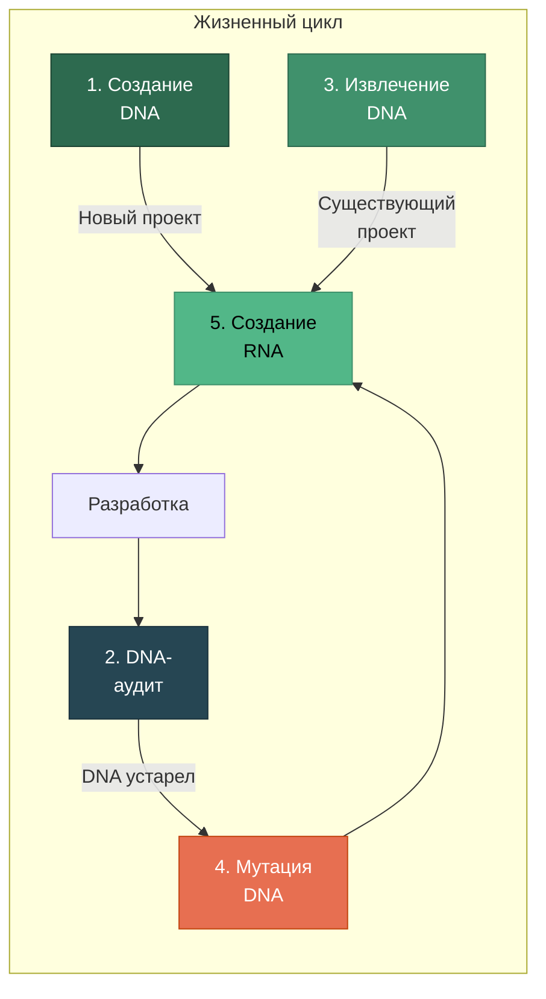
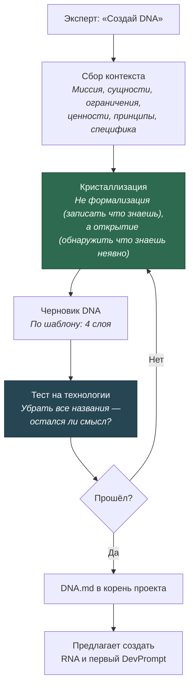
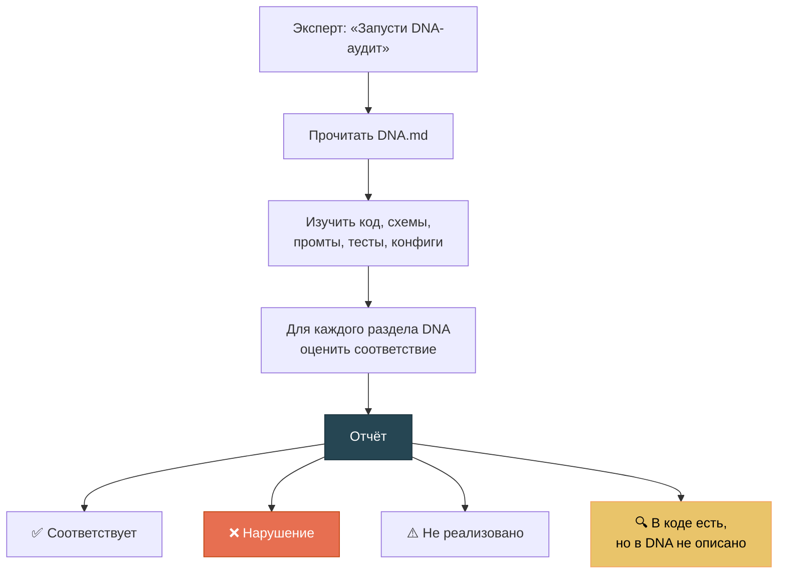
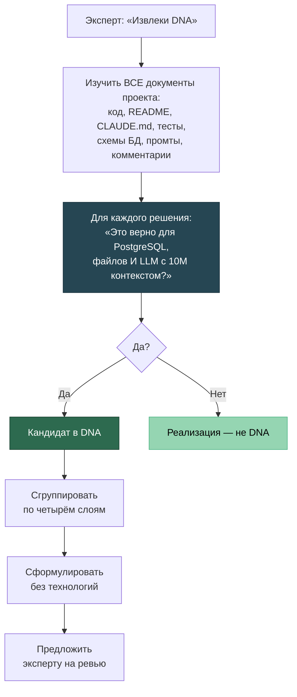
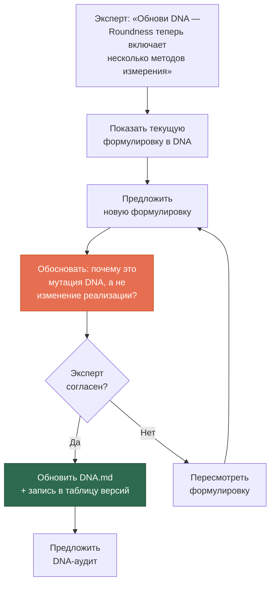
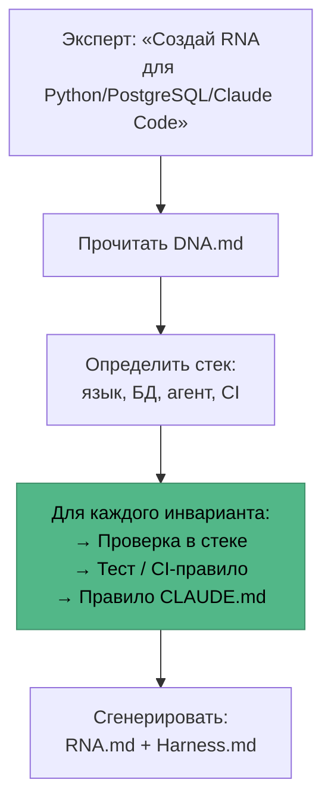
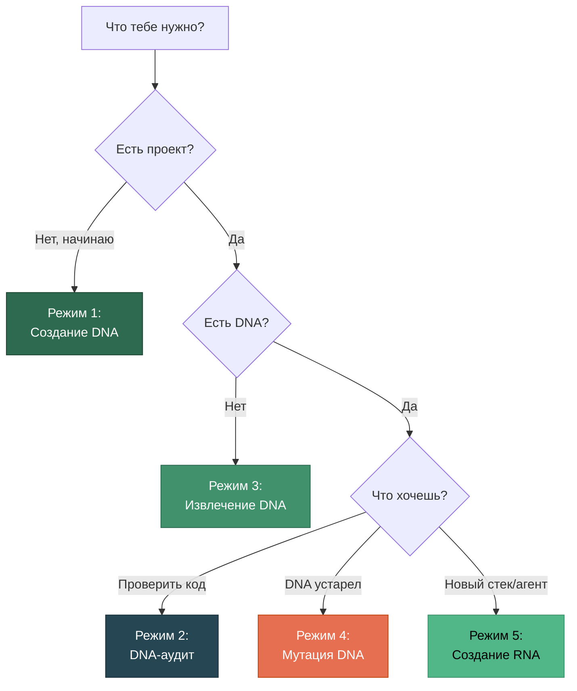

# Пять режимов работы

[EN version](modes-en.md)

Project DNA имеет пять режимов. Каждый решает свою задачу в жизненном цикле проекта.



---

## Режим 1: Создание DNA

**Когда:** Начинаешь новый проект.

**Триггеры:** *«создай DNA»*, *«начни проект»*, *«давай с начала»*

### Как это работает



### Пример диалога

```
Ты: Создай DNA для проекта анализа осадочных горных пород.

AI: Начнём с миссии. Зачем существует эта система?

Ты: Мы анализируем зёрна в шлифах — их размер, форму, 
    окатанность. Нужно автоматизировать то, что геологи 
    делают вручную под микроскопом.

AI: Понял. Несколько уточнений:
    1. Roundness и Circularity — это разные параметры или синонимы?
    2. Обучающая выборка — это разовый ресурс или постоянный актив?
    3. Что важнее — скорость обработки или точность классификации?

Ты: Roundness и Circularity — строго разные вещи! 
    Путать нельзя...
```

**Ключевой момент:** Вопрос про Roundness/Circularity — это кристаллизация. Эксперт знал, что они разные, но не сформулировал это как инвариант до вопроса AI.

---

## Режим 2: DNA-аудит

**Когда:** Хочешь проверить, не отклонился ли код от инвариантов.

**Триггеры:** *«DNA-аудит»*, *«проверь соответствие»*, *«что у нас за инварианты»*

### Как это работает



### Что отдаёт аудит

Только диагностику, **не предложения по исправлению**:

```
## DNA-аудит: SciProof

### Онтология
✅ Факт ≠ Утверждение — реализовано (таблицы facts, claims)
❌ Measurement ≠ Interpretation — склеены в одну модель
⚠️ Типизация фактов по источнику — не реализовано

### Деонтика  
✅ Оригиналы неизменяемы — immutable flag
🔍 Чанки не разрезают описания скважин — реализовано,
   но инвариант не записан в DNA

### Аксиология
✅ Полнота > скорость — timeout 60 сек
❌ Качество дистилляции — нет метрик в CI

### Требуют ручной проверки
- Корректность онтологических различений 
  (только эксперт может подтвердить)
```

---

## Режим 3: Извлечение DNA

**Когда:** У тебя есть проект, но нет DNA. Хочешь извлечь инварианты из того, что уже написано.

**Триггеры:** *«извлеки DNA»*, *«что у нас за инварианты»*, *«давай с начала»*

### Как это работает



---

## Режим 4: Мутация DNA

**Когда:** Понимание предметной области изменилось. Не код, не стек — само знание о мире.

**Триггеры:** *«обнови DNA»*, *«это решение изменилось»*, *«почему так устроено»*

### Как это работает



### Важное правило

Агент **предлагает** мутацию, но **не коммитит** без согласия эксперта. DNA обновляется только владельцем проекта.

---

## Режим 5: Создание RNA

**Когда:** DNA готов, нужно создать enforcement-правила для конкретного стека.

**Триггеры:** *«создай RNA»*, *«создай harness»*, *«транслируй инварианты в правила»*

### Как это работает



### Пример трансляции

| DNA (инвариант) | RNA (Python/PostgreSQL) |
|----------------|------------------------|
| «Факт ≠ Утверждение» | Модели `Fact` и `Claim` — разные классы. Тест: `test_fact_claim_separation()` |
| «Оригиналы неизменяемы» | `UPDATE originals SET ...` запрещён. SQL constraint: `BEFORE UPDATE RAISE EXCEPTION` |
| «Прослеживаемость» | `source_ref` NOT NULL в миграции. CI: `SELECT count(*) WHERE source_ref IS NULL = 0` |
| «Полнота > скорость» | Timeout 60 сек. Нет `LIMIT` без явного обоснования в комментарии |

---

## Когда какой режим


