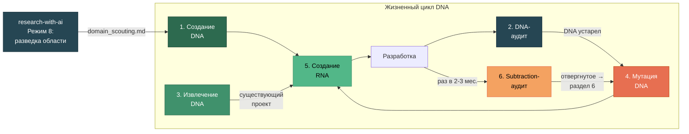
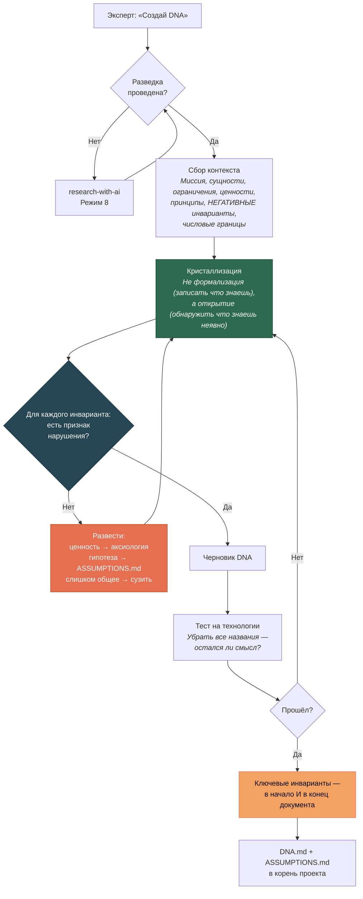
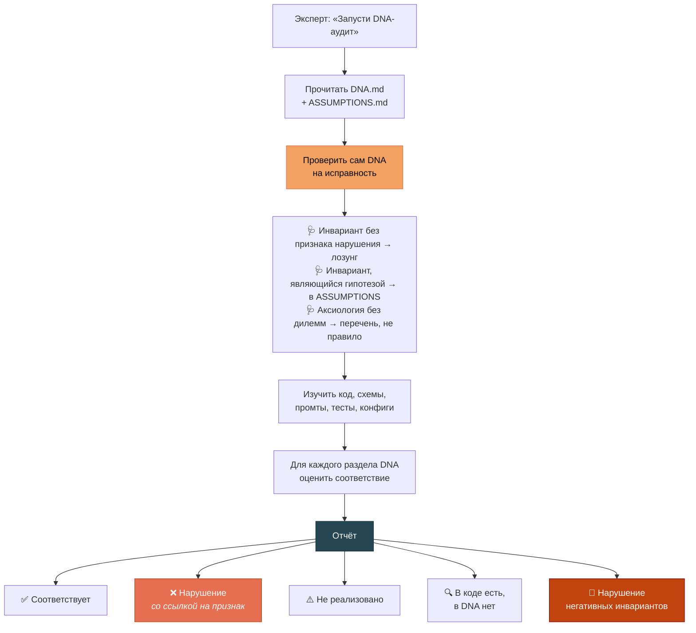
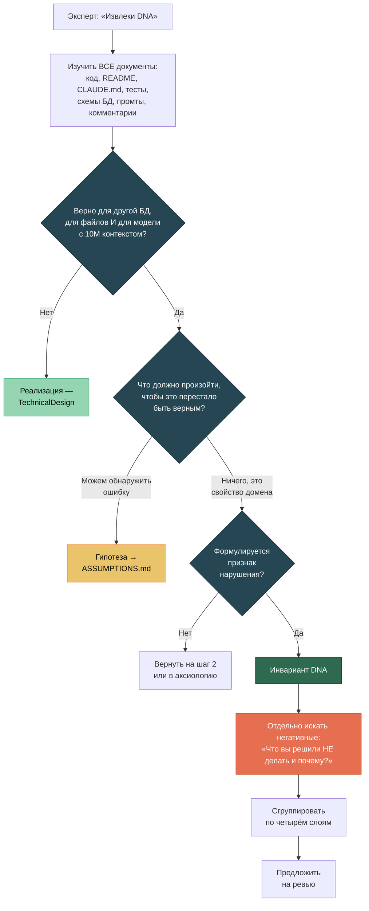
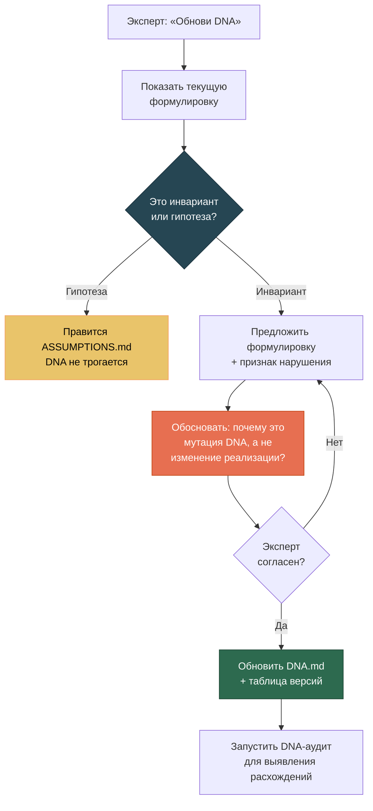
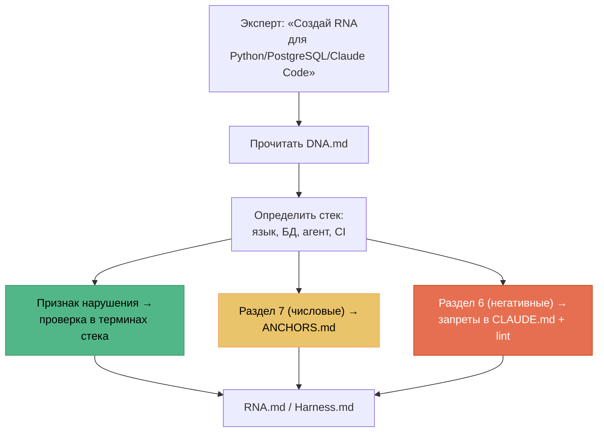
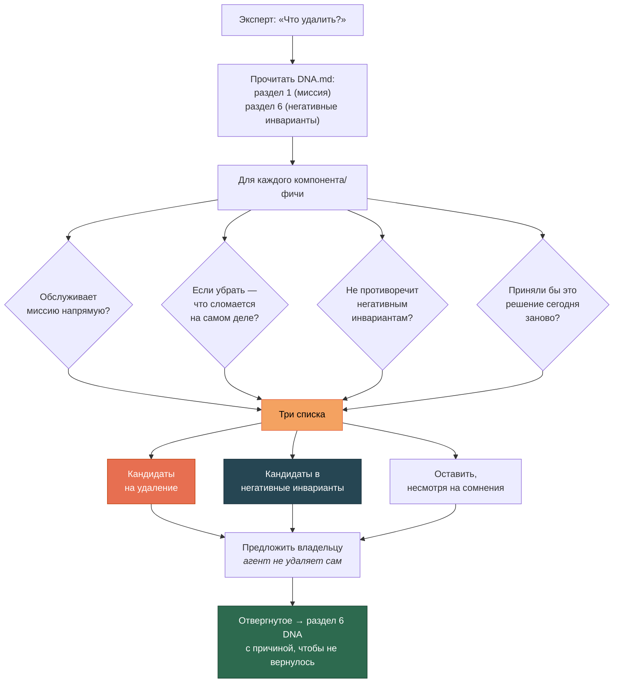
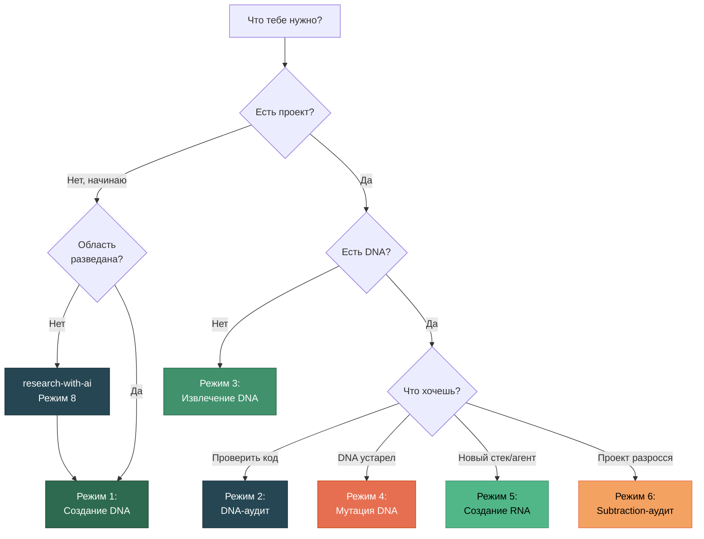

# Шесть режимов работы

[EN version](modes-en.md)

Project DNA имеет шесть режимов. Каждый решает свою задачу в жизненном цикле проекта.



---

## Режим 1: Создание DNA

**Когда:** Начинаешь новый проект.

**Триггеры:** *«создай DNA»*, *«начни проект»*, *«давай с начала»*

### Шаг 0: проверка готовности разведки (обязательный)

DNA без разведки предметной области — декларативный документ, опирающийся на правдоподобие формулировок ИИ или авторитет чужих источников, но не на обоснованные предпосылки.

Перед формулированием DNA — пять контрольных вопросов:

| Вопрос | Критерий готовности |
|--------|--------------------|
| **Онтологический** | Можешь описать карту сущностей с опорой на 3+ независимых прецедента? |
| **Прецедентный** | Знаешь 3-5 аналогичных проектов, включая хотя бы один неудачный, и их фактические failure modes? |
| **Категориальный** | Идентифицированы места, где ИИ перенесёт категории из training data ошибочно? |
| **Конфликтный** | Известны реальные дилеммы аксиологии в области и как их решали? |
| **Граничный** | Можешь отделить объект проекта от соседних с конкретными критериями? |

Хоть один ответ «не уверен» → **не переходи к шагу 1**. Иди в `research-with-ai`, Режим 8.

### Как это работает



### Почему ключевые инварианты дублируются

Правило, стоящее в середине длинного контекста, статистически игнорируется агентом. Это свойство attention-архитектуры, не лень модели. Поэтому ключевые инварианты размещаются в **начале** документа и дублируются в **конце**.

Подробнее: `architect-cc-workflow` §5.3.

### Пример диалога

```
Ты: Создай DNA для проекта анализа осадочных горных пород.

AI: Сначала проверим готовность разведки. Можешь описать карту
    сущностей с опорой на 3+ независимых прецедента?

Ты: Да — есть три работы по морфометрии зёрен, две из них
    с разными подходами к классификации.

AI: [...остальные четыре вопроса...]
    Хорошо, разведка достаточна. Начнём с миссии.

Ты: Мы анализируем зёрна в шлифах — размер, форму, окатанность.
    Автоматизируем то, что геологи делают вручную.

AI: Уточнения:
    1. Roundness и Circularity — разные параметры или синонимы?
    2. Обучающая выборка — разовый ресурс или постоянный актив?

Ты: Roundness и Circularity — строго разные вещи!

AI: Это инвариант. Какой признак нарушения? Что я увижу
    в коде или данных, если он нарушен?

Ты: Если в одной колонке лежат значения обоих параметров,
    или если одно вычисляется из другого.
```

**Два ключевых момента:** вопрос про Roundness/Circularity — кристаллизация (эксперт знал, но не формулировал). Вопрос про признак нарушения — превращение формулировки в проверяемое условие.

---

## Режим 2: DNA-аудит

**Когда:** Проверить, не отклонился ли код от инвариантов.

**Триггеры:** *«DNA-аудит»*, *«проверь соответствие»*

**Регулярные триггеры** (не только по запросу): завершение фазы, смена стека, возврат после паузы > 1 месяца, перед публикацией или передачей.

### Как это работает



### Проверка самого DNA — до проверки кода

Новое по сравнению с ранними версиями: аудит начинается с диагностики **качества самого DNA**, а не сразу кода. Смысла проверять код на соответствие лозунгам нет.

```
🩺 Качество инвариантов:
- «Система должна быть надёжной» — лозунг без признака
  нарушения, требует переформулировки
- «Библиотека X не поддерживает Y» — гипотеза,
  перенести в ASSUMPTIONS.md
- Раздел 4 содержит список ценностей без разрешённых
  дилемм — агент не может применить перечень
```

### Что отдаёт аудит

Только диагностику, **не предложения по исправлению**:

```
## DNA-аудит: SciProof

### Онтология
✅ Факт ≠ Утверждение — реализовано (таблицы facts, claims)
❌ Measurement ≠ Interpretation — склеены в одну модель
   Признак нарушения (DNA §3.2): одна таблица содержит
   и измеренные, и интерпретированные значения → подтверждён

### Негативные инварианты
🚫 DNA §6.3 запрещает ORM-абстракции поверх SQL —
   в core/repository.py появился слой аналогичный ORM

### Требуют ручной проверки
- Корректность онтологических различений
```

---

## Режим 3: Извлечение DNA

**Когда:** Проект есть, DNA нет.

**Триггеры:** *«извлеки DNA»*, *«что у нас за инварианты»*

### Как это работает



### Негативные инварианты почти никогда не записаны

Но они есть в решениях: что команда отвергла, почему что-то не автоматизировано, какие зависимости запрещены. Спрашивать нужно прямо: **«Что вы решили НЕ делать и почему?»**

---

## Режим 4: Мутация DNA

**Когда:** Понимание предметной области изменилось.

**Триггеры:** *«обнови DNA»*, *«это решение устарело»*

### Как это работает



### Важное правило

Агент **предлагает** мутацию, но **не коммитит** без согласия эксперта. DNA обновляется только владельцем проекта.

Первая развилка — новая: значительная часть запросов «обнови DNA» на деле касается гипотез. Они правятся в `ASSUMPTIONS.md`, DNA остаётся нетронутым.

---

## Режим 5: Создание RNA

**Когда:** DNA готов, нужны enforcement-правила для стека.

**Триггеры:** *«создай RNA»*, *«создай harness»*

### Как это работает



### Признак нарушения — это и есть спецификация проверки

Инвариант без признака нарушения **непереводим в RNA**. Это ещё одна причина требовать его на этапе создания DNA.

| DNA | Признак нарушения | RNA (Python/PostgreSQL) |
|-----|------------------|------------------------|
| «Факт ≠ Утверждение» | Одна таблица содержит оба типа | Модели `Fact` и `Claim` раздельны. Тест: `test_fact_claim_separation()` |
| «Оригиналы неизменяемы» | Существует UPDATE-путь к таблице originals | SQL trigger `BEFORE UPDATE RAISE EXCEPTION` |
| «Прослеживаемость» | Запись с непустым значением и пустым провенансом | `source_ref NOT NULL`. CI: `SELECT count(*) WHERE source_ref IS NULL = 0` |

### Числовые инварианты → ANCHORS.md

Раздел 7 DNA (числовые инварианты домена) порождает `ANCHORS.md` — набор якорей самопроверки агента.

**Разделение ответственности:** DNA говорит **почему** величина такая; `ANCHORS.md` и constants-файл — **какая** она конкретно.

Подробнее: `architect-cc-workflow` §14.1.

---

## Режим 6: Subtraction-аудит

**Когда:** Регулярно (раз в 2-3 месяца) для активных проектов.

**Триггеры:** *«что удалить»*, *«проект разросся»*, *«давай почистим»*

### Зачем

Проекты разрастаются через **accretion**: каждое добавление выглядит разумным, сумма разрушает целостность. Дефолтный режим работы — добавлять. Subtraction-аудит — сознательное противодействие.

Добавление фич может превратить инструмент в то, против чего он создавался. Удаление половины roadmap бывает лучшим продуктовым решением.

### Как это работает



### Что отдаёт аудит

```
### Кандидаты на удаление
- Экспорт в XML — не обслуживает миссию, добавлен
  по одному разовому запросу. Освободит 340 LOC + зависимость lxml

### Кандидаты в негативные инварианты
- Автоматическая интерпретация результатов — отвергнута
  дважды за год. Зафиксировать в разделе 6, чтобы не возвращалась

### Оставить, несмотря на сомнения
- CLI-интерфейс — выглядит дублированием веб-UI, но это
  единственный путь для batch-обработки
```

**Важно:** агент не удаляет сам. Удаление — решение владельца, как и мутация DNA.

---

## Какой режим мне нужен


