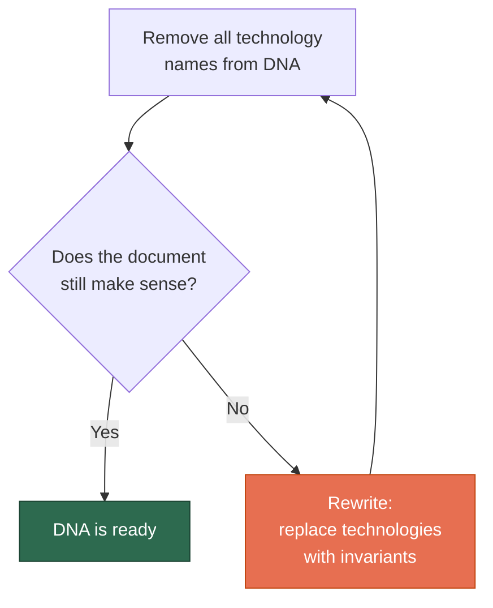
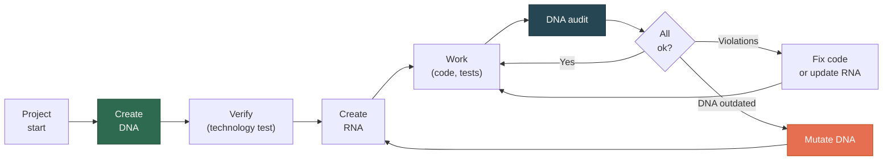

# Quick Start

[RU version](quickstart-ru.md)

A step-by-step guide — from zero to working DNA in 30 minutes.

## What You Need

- Claude Code (installed and working)
- A project you want to create DNA for
- 30 minutes for dialogue with AI

## Step 1: Install the Skill

```bash
# Option A: as a plugin (recommended)
claude plugin add SizovOleg/project-dna

# Option B: for a single project
cp -r skills/project-dna .claude/skills/

# Option C: for all projects
cp -r skills/project-dna ~/.claude/skills/
```

Verify: open Claude Code and say *"What skills do you have?"*. `project-dna` should be in the list.

## Step 2: Create DNA

Open Claude Code in your project root and say:

> **"Create a DNA for this project"**

A crystallization dialogue begins. The model will ask:

```
- Why does this system exist? (mission)
- What entities exist in the domain? (ontology)
- What can never be violated? (deontology)
- What is more important than what? (axiology)
- How should we approach tasks? (praxeology)
```

**Take your time.** DNA is not a formality. It's a process of realizing what you know but haven't articulated. The model helps crystallize implicit knowledge.

### What You Get

A `DNA.md` file in the project root. Roughly:

```markdown
# DNA: MyProject

## Mission
System for [what it does] in the context of [for whom].

## Ontology
- Entity A and Entity B are different because...
- Typology: ...

## Deontology
- Originals are immutable
- Every assertion is traceable to its source

## Axiology
- Completeness over speed
- Quality > quantity

## Praxeology
- Simplicity over architectural perfection
- Derived layers are regenerable
```

Full example: [examples/example-dna.md](../examples/example-dna.md)

## Step 3: Verify DNA

Run the **technology test**: remove all technology names, languages, and frameworks from the document. If it still makes sense — it's real DNA. If not — implementation leaked in.



### Common Mistakes

| Mistake in DNA | How to fix |
|---------------|------------|
| "We use PostgreSQL for storage" | "Data is stored in a relational model with normalization" |
| "React component displays..." | "User sees a list of entities with filtering" |
| "API returns JSON" | Remove — this is implementation, not an invariant |
| "Claude Code generates tests" | "Every invariant is automatically verifiable" |

## Step 4: Create RNA

When DNA is ready, say:

> **"Create RNA for [your stack]"**

Example: *"Create RNA for Python/PostgreSQL/Claude Code"*

The model takes each DNA invariant and translates it into concrete rules:

| DNA (invariant) | RNA (rule) |
|-----------------|-----------|
| "Fact ≠ Claim" | `facts` and `claims` are separate tables. Test: `SELECT count(*) FROM claims WHERE fact_id IS NULL = 0` |
| "Traceability" | `source_ref NOT NULL` in every table. CI: check for empty references |
| "Completeness > speed" | Processing timeout: 60 sec (not 5). CI: no skips in completeness tests |

You'll get `RNA.md` and an updated `CLAUDE.md`.

## Step 5: Work and Verify

Now work as usual. Periodically (after major milestones) run:

> **"Run a DNA audit"**

You'll get a report:

```
## DNA Audit: MyProject

### Ontology
✅ Fact ≠ Claim — implemented (tables facts, claims)
❌ Measurement ≠ Interpretation — merged in one model
⚠️ Fact type classification — not implemented

### Deontology
✅ Originals immutable — immutable flag
🔍 "Don't split within well descriptions" — implemented in code
   but invariant not recorded in DNA
```

## Full Cycle (visual)



## Step 6 (optional): Connect Other Skills

For the full ecosystem, connect:

- **architect-cc-workflow** — discipline for formulating Claude Code tasks
- **research-with-ai** — epistemic verification of results

Details: [Three-Skill Ecosystem](ecosystem-en.md)

## FAQ

**Q: I already have a project without DNA. Where do I start?**
A: Say *"Extract DNA from this codebase"*. The model will study code, docs, tests and propose a DNA. You review and approve.

**Q: Must DNA be in English?**
A: No. DNA can be in any language the domain expert understands. Russian, English, German — doesn't matter. What matters is precision of formulations.

**Q: What if DNA is outdated?**
A: Say *"Update DNA — [what changed]"*. The model shows the current version, proposes a change, justifies why this is a DNA mutation (not just an implementation change), and updates with a version table entry.

**Q: Can I use DNA without Claude Code?**
A: Yes. DNA is a plain markdown file. It's useful on its own as project documentation. But with an AI agent, it works as a **contract**: the agent treats DNA as a set of invariants.

**Q: How long does DNA creation take?**
A: 20-40 minutes for a medium-complexity project. The better you know your domain, the faster. If it takes over an hour, implementation is leaking into DNA.
