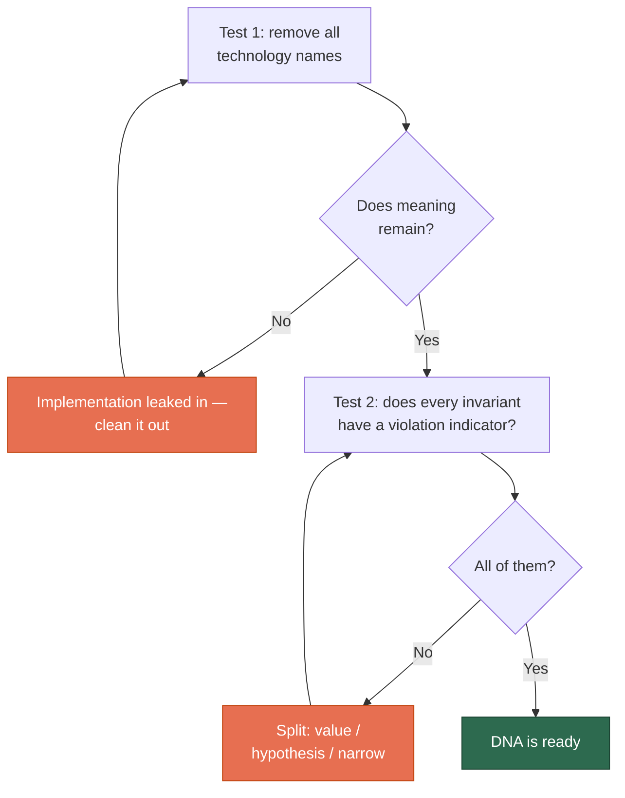
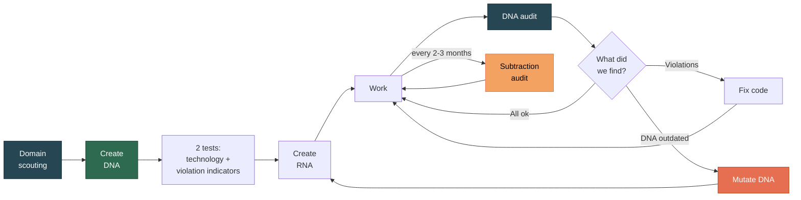

# Quick Start

[RU version](quickstart-ru.md)

A step-by-step guide — from zero to working DNA.

## What You Need

- Claude Code (installed and working)
- A project to create DNA for
- 30-40 minutes of dialogue
- **Domain knowledge** — not just general familiarity, but grounded in precedents (see step 2)

## Step 1: Install the Skill

```bash
cp -r skills/project-dna ~/.claude/skills/
```

For the full ecosystem, copy all three:

```bash
cp -r skills/project-dna skills/architect-cc-workflow skills/research-with-ai ~/.claude/skills/
```

Verify: open Claude Code and say *"What skills do you have?"*.

## Step 2: Check Scouting Readiness

**This is a mandatory step, not a formality.** DNA without domain scouting is a declarative document resting on the plausibility of AI phrasing rather than on justified premises.

Answer five questions for yourself:

| Question | Ready if… |
|----------|-----------|
| **Ontological** | You can map the domain entities against **3+ independent precedents** — not one textbook |
| **Precedent** | You know 3-5 analogous projects, **including at least one failure**, and their actual failure modes |
| **Categorical** | You know where AI will wrongly transfer training-data categories into your domain |
| **Conflict** | You know the real priority dilemmas in the area and how others resolved them |
| **Boundary** | You can separate your project's object from adjacent ones with concrete criteria |

**Any "not sure" → scout first.** Tell Claude Code:

> **"Scout the domain before creating DNA"**

This runs `research-with-ai` Mode 8 — you get `domain_scouting.md`, which becomes the foundation for DNA.

If all five are confident yeses backed by concrete precedents, move on.

## Step 3: Create DNA

Open Claude Code in your project root:

> **"Create a DNA for this project"**

A crystallization dialogue begins. The model asks about mission, entities, constraints, priorities, principles — and separately about what people usually forget:

- **What should the system NOT do?** What was rejected? Where is a human better than a machine?
- **Which numeric domain quantities have hard bounds?**

**Take your time.** DNA is a process of realizing what you know but never put into words.

### The Key Moment: Violation Indicator

For every invariant the model asks: **"What's the violation indicator?"**

This isn't nitpicking. **An invariant you cannot observably violate is not an invariant — it's a slogan.**

```
You: Completeness matters more than speed.

AI:  What's the violation indicator? What would I see in the code
     or data if this principle were broken?

You: Hmm... I can't point to a concrete state.

AI:  Then it's a value, not a constraint. Let's reformulate it as
     a resolved dilemma: "When we can't both process all documents
     and stay under 5 seconds → choose completeness, because a
     missed publication costs more than a slow response."

     Now a violation indicator exists: the code contains a LIMIT
     or a timeout < 30 sec without justification in a comment.
```

If no indicator can be formulated, it's one of three things:

| What it is | Where it goes |
|-----------|--------------|
| A value | Into axiology, as a **resolved dilemma** |
| A hypothesis | Into `ASSUMPTIONS.md` |
| Too broad a formulation | Narrow it until checkable |

### The Second Key Moment: Invariant or Hypothesis?

The test question: **what would have to happen for this to stop being true?**

- "Nothing, it's a property of the domain" → **invariant**, into `DNA.md`
- "We might discover we were wrong" → **hypothesis**, into `ASSUMPTIONS.md`

Three categories that look like invariants but aren't:

- **Technology constraints** ("library X can't do Y") — a hypothesis, testable by probe
- **Volume expectations** ("there'll be about N records") — a hypothesis until measured
- **Slogans with no violation indicator** ("the system must be reliable")

Mixing them is why DNA either fossilizes (hypotheses can't be revised because "it's DNA") or becomes worthless (rewritten weekly).

### What You Get

Two files in the project root:

```
DNA.md            — invariants
ASSUMPTIONS.md    — hypotheses with status VERIFIED / UNVERIFIED / FAILED
```

Full example: [examples/example-dna.md](../examples/example-dna.md)

## Step 4: Verify DNA

Two tests:



### Common Mistakes

| Mistake in DNA | How to fix |
|---------------|-----------|
| "We use PostgreSQL" | "Data is stored in a relational model" |
| "API returns JSON" | Remove — implementation, not an invariant |
| "The system must be reliable" | Slogan. Narrow until checkable, or move to axiology |
| "Library X is slow" | Hypothesis → `ASSUMPTIONS.md` |
| A list of values with no dilemmas | Reformulate as rules of choice |
| No "what we don't build" section | Add negative invariants |

### Placement for the Agent

Key invariants must appear **at the start** of the document and be duplicated **at the end**.

A rule in the middle of a long context is statistically ignored by the agent. This is attention architecture, not model laziness. The model will add a "Key Invariants (repeated for the agent)" section — don't delete it as duplication.

## Step 5: Create RNA

> **"Create RNA for Python/PostgreSQL/Claude Code"**

The model takes each invariant's **violation indicator** and turns it into a concrete check:

| DNA | Violation indicator | RNA |
|-----|--------------------|-----|
| "Fact ≠ Claim" | One table holds both types | Separate models. Test: `test_fact_claim_separation()` |
| "Traceability" | Record with non-empty value and empty provenance | `source_ref NOT NULL`. CI check |

You'll get:

```
RNA.md         — enforcement rules
CLAUDE.md      — contract with the agent
ANCHORS.md     — numeric self-check anchors (if the project is data-heavy)
```

**ANCHORS.md** comes from DNA section 7 (numeric invariants). A short list of known-correct values the agent checks its output against before reporting. DNA says **why** a quantity is what it is; ANCHORS.md says **what** it concretely is.

## Step 6: Work and Verify

Periodically:

> **"Run a DNA audit"**

The audit starts by checking **the DNA itself** — are there slogans without violation indicators, did hypotheses sneak in. Then it checks the code:

```
## DNA Audit: MyProject

🩺 Invariant quality:
- §4.2 "high performance" — slogan with no indicator

### Ontology
✅ Fact ≠ Claim — implemented
❌ Measurement ≠ Interpretation — merged
   Violation indicator (§3.2) confirmed

### Negative Invariants
🚫 §6.3 forbids ORM over SQL —
   core/repository.py grew a similar layer
```

## Step 7: Every 2-3 Months — Subtraction Audit

> **"What can we remove from the project?"**

Projects sprawl through accretion: each addition looks reasonable, the sum destroys coherence. The default working mode is to add. This audit is deliberate counter-pressure.

You get three lists: deletion candidates, candidates for negative invariants, keep-despite-doubts.

Rejected items go into DNA section 6 with a reason — so they don't come back in six months.

## Full Cycle



## FAQ

**Q: I already have a project without DNA. Where do I start?**
A: Say *"Extract DNA from this codebase"*. The model studies the code and proposes a DNA. It will separately ask: "What did you decide NOT to do, and why?" — negative invariants are almost never written down, but they live in the decisions.

**Q: Do I really have to do the scouting? I have 15 years in this field.**
A: The five questions take about ten minutes. Experience covers the ontological and boundary questions, but the categorical one (where AI will err in *your* domain) is usually open even for experts — it's a question about the model, not the domain.

**Q: How is ASSUMPTIONS.md different from a TODO?**
A: A TODO is what to do. ASSUMPTIONS is what we believe but haven't verified, and what breaks if the belief is wrong. Format: statement → consequence → how to check → status.

**Q: Must DNA be in English?**
A: No, any language the domain expert understands. What matters is precision of formulation.

**Q: How long does DNA creation take?**
A: 30-40 minutes for a medium-complexity project, plus scouting if needed. If DNA takes more than two hours, implementation is leaking in.

**Q: Can I use DNA without Claude Code?**
A: Yes, it's plain markdown. But with an agent it works as a **contract**: the agent treats DNA as invariants it must not violate silently.
