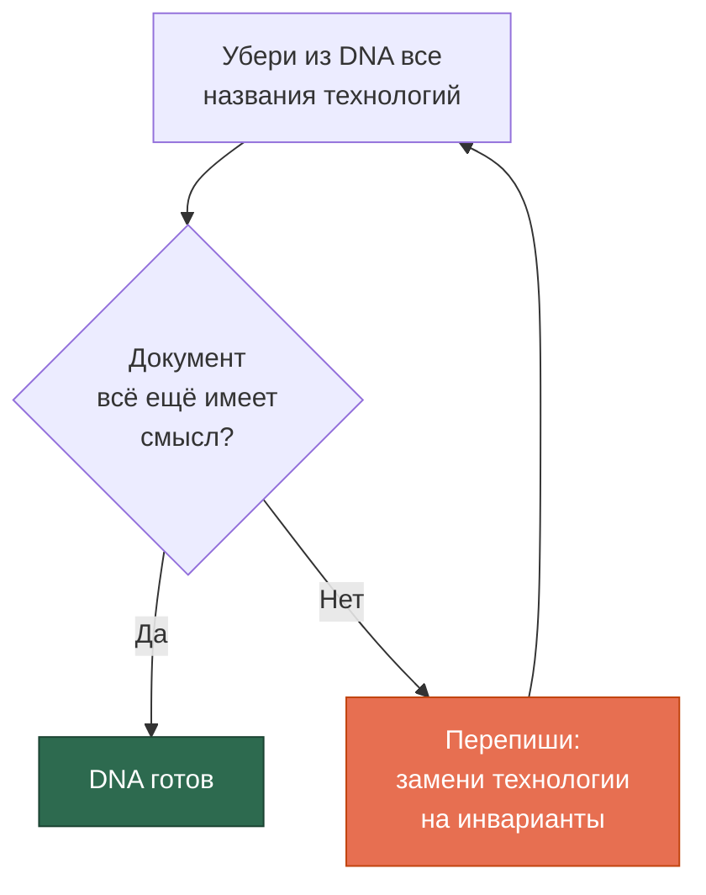
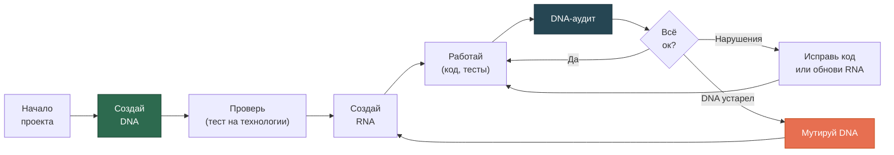

# Быстрый старт

[EN version](quickstart-en.md)

Это пошаговое руководство — от нуля до работающего DNA за 30 минут.

## Что тебе нужно

- Claude Code (установлен и работает)
- Проект, для которого ты хочешь создать DNA
- 30 минут на диалог с AI

## Шаг 1: Установи скилл

```bash
# Вариант A: как плагин (рекомендуется)
claude plugin add SizovOleg/project-dna

# Вариант B: для одного проекта
cp -r skills/project-dna .claude/skills/

# Вариант C: для всех проектов
cp -r skills/project-dna ~/.claude/skills/
```

Проверь, что скилл виден: открой Claude Code и скажи *«Какие у тебя скиллы?»*. В списке должен быть `project-dna`.

## Шаг 2: Создай DNA

Открой Claude Code в корне проекта и скажи:

> **«Создай DNA для этого проекта»**

Начнётся диалог кристаллизации. Модель будет задавать вопросы:

```
- Зачем существует эта система? (миссия)
- Какие сущности есть в предметной области? (онтология)
- Что нельзя нарушить ни при какой реализации? (деонтика)
- Что важнее чего? (аксиология)
- Как подходить к задачам? (праксеология)
```

**Не торопись.** DNA — это не формальность. Это процесс осознания того, что ты знаешь, но не формулировал словами. Модель помогает кристаллизовать неявное знание.

### Что получится

Файл `DNA.md` в корне проекта. Примерно так:

```markdown
# DNA: МойПроект

## Миссия
Система для [что делает] в контексте [для кого].

## Онтология
- Сущность A и Сущность B — разные вещи, потому что...
- Типизация: ...

## Деонтика
- Оригиналы неизменяемы
- Каждое утверждение прослеживаемо до источника

## Аксиология
- Полнота важнее скорости
- Качество > количество

## Праксеология
- Простота превыше архитектурного совершенства
- Производные слои перегенерируемы
```

Полный пример: [examples/example-dna.md](../examples/example-dna.md)

## Шаг 3: Проверь DNA

Пройди **тест на технологии**: убери из документа все названия технологий, языков, фреймворков. Если документ всё ещё имеет смысл — это настоящий DNA. Если нет — в него попала реализация.



### Типичные ошибки

| Ошибка в DNA | Как исправить |
|-------------|---------------|
| «Используем PostgreSQL для хранения» | «Данные хранятся в реляционной модели с нормализацией» |
| «React-компонент отображает...» | «Пользователь видит список сущностей с фильтрацией» |
| «API возвращает JSON» | Убрать — это реализация, не инвариант |
| «Claude Code генерирует тесты» | «Каждый инвариант проверяем автоматически» |

## Шаг 4: Создай RNA

Когда DNA готов, скажи:

> **«Создай RNA для [твой стек]»**

Например: *«Создай RNA для Python/PostgreSQL/Claude Code»*

Модель возьмёт каждый инвариант из DNA и транслирует в конкретные правила:

| DNA (инвариант) | RNA (правило) |
|----------------|---------------|
| «Факт ≠ Утверждение» | `facts` и `claims` — разные таблицы. Тест: `SELECT count(*) FROM claims WHERE fact_id IS NULL = 0` |
| «Прослеживаемость» | `source_ref NOT NULL` в каждой таблице. CI: проверка на пустые ссылки |
| «Полнота > скорость» | Timeout для обработки: 60 сек (не 5). CI: нет skip-ов в тестах полноты |

Получатся файлы `RNA.md` и обновлённый `CLAUDE.md`.

## Шаг 5: Работай и проверяй

Теперь работаешь как обычно. Периодически (после крупных этапов) запускай:

> **«Запусти DNA-аудит»**

Получишь отчёт:

```
## DNA-аудит: МойПроект

### Онтология
✅ Факт и Утверждение — разделены (таблицы facts, claims)
❌ Типизация фактов — отсутствует enum fact_type
⚠️ Категории авторов — не реализовано

### Деонтика
✅ Оригиналы неизменяемы — реализовано через immutable flag
🔍 «Не резать внутри описаний» — не отражено в DNA, но реализовано в коде
```

## Полный цикл (визуально)



## Шаг 6 (по желанию): Подключи остальные скиллы

Для полной экосистемы подключи:

- **architect-cc-workflow** — дисциплина формулировки задач для Claude Code
- **research-with-ai** — эпистемическая проверка результатов

Подробнее: [Экосистема трёх скиллов](ecosystem-ru.md)

## FAQ

**Q: У меня уже есть проект без DNA. С чего начать?**
A: Скажи *«Извлеки DNA из этого кода»*. Модель изучит код, документацию, тесты и предложит DNA. Ты проверишь и утвердишь.

**Q: DNA обязательно на английском?**
A: Нет. DNA на любом языке, который понимает доменный эксперт. Русский, английский, немецкий — неважно. Главное — точность формулировок.

**Q: Что если DNA устарел?**
A: Скажи *«Обнови DNA — [что изменилось]»*. Модель покажет текущую версию, предложит изменение, обоснует почему это мутация DNA (а не просто изменение реализации) и обновит с записью в таблицу версий.

**Q: Можно ли использовать DNA без Claude Code?**
A: Да. DNA — обычный markdown-файл. Он полезен сам по себе как документация проекта. Но с AI-агентом он работает как **контракт**: агент трактует DNA как набор инвариантов.

**Q: Сколько времени занимает создание DNA?**
A: 20-40 минут для проекта средней сложности. Чем лучше ты знаешь предметную область, тем быстрее. Если занимает больше часа — в DNA попадает реализация.
