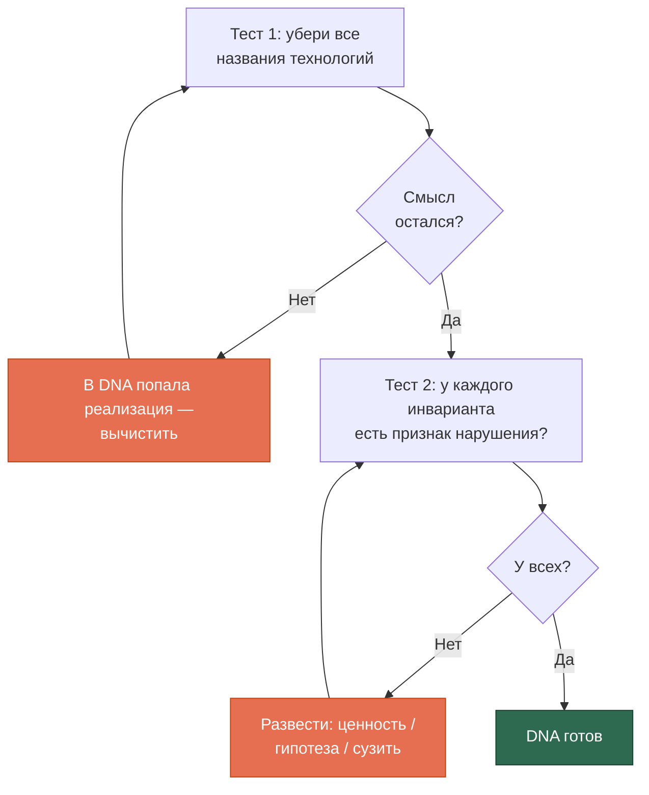
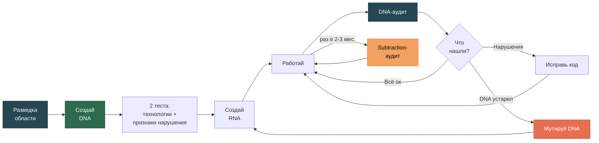

# Быстрый старт

[EN version](quickstart-en.md)

Пошаговое руководство — от нуля до работающего DNA.

## Что тебе нужно

- Claude Code (установлен и работает)
- Проект, для которого создаёшь DNA
- 30-40 минут на диалог
- **Знание предметной области** — не только общее, но с опорой на прецеденты (см. шаг 2)

## Шаг 1: Установи скилл

```bash
cp -r skills/project-dna ~/.claude/skills/
```

Для всей экосистемы скопируй все три:

```bash
cp -r skills/project-dna skills/architect-cc-workflow skills/research-with-ai ~/.claude/skills/
```

Проверь: открой Claude Code и скажи *«Какие у тебя скиллы?»*.

## Шаг 2: Проверь готовность разведки

**Это обязательный шаг, а не формальность.** DNA без разведки предметной области — декларативный документ, который держится на правдоподобии формулировок ИИ, а не на обоснованных предпосылках.

Ответь себе на пять вопросов:

| Вопрос | Готов, если… |
|--------|-------------|
| **Онтологический** | Можешь описать карту сущностей области с опорой на **3+ независимых прецедента** — не на один учебник |
| **Прецедентный** | Знаешь 3-5 аналогичных проектов, **включая хотя бы один неудачный**, и их фактические failure modes |
| **Категориальный** | Знаешь, где ИИ перенесёт категории из training data ошибочно для твоей области |
| **Конфликтный** | Знаешь реальные дилеммы приоритетов в области и как их решали другие |
| **Граничный** | Можешь отделить объект проекта от соседних с конкретными критериями |

**Хоть один ответ «не уверен» → сначала разведка.** Скажи Claude Code:

> **«Проведи разведку предметной области перед созданием DNA»**

Запустится `research-with-ai` Режим 8 — получишь `domain_scouting.md`, который станет опорой для DNA.

Если все пять — уверенные «да» со ссылкой на конкретные прецеденты, переходи дальше.

## Шаг 3: Создай DNA

Открой Claude Code в корне проекта:

> **«Создай DNA для этого проекта»**

Начнётся диалог кристаллизации. Модель спросит про миссию, сущности, ограничения, приоритеты, принципы — и отдельно про то, что обычно забывают:

- **Что система НЕ должна делать?** Что отвергнуто? Где человек лучше машины?
- **Какие числовые величины домена имеют жёсткие границы?**

**Не торопись.** DNA — процесс осознания того, что ты знаешь, но не формулировал словами.

### Ключевой момент: признак нарушения

На каждый инвариант модель спросит: **«Какой признак нарушения?»**

Это не придирка. **Инвариант, который нельзя нарушить наблюдаемо, — не инвариант, а лозунг.**

```
Ты:  Полнота важнее скорости.

AI:  Какой признак нарушения? Что я увижу в коде или данных,
     если этот принцип нарушен?

Ты:  Хм... не могу указать конкретное состояние.

AI:  Тогда это ценность, а не ограничение. Переформулируем
     как разрешённую дилемму: «Когда нельзя одновременно
     обработать все документы и уложиться в 5 секунд →
     выбираем полноту, потому что пропущенная публикация
     дороже медленного ответа».

     Теперь признак нарушения формулируется: в коде есть
     LIMIT или timeout < 30 сек без обоснования в комментарии.
```

Не удаётся сформулировать признак — одно из трёх:

| Что это | Куда идёт |
|---------|----------|
| Ценность | В аксиологию, как **разрешённая дилемма** |
| Гипотеза | В `ASSUMPTIONS.md` |
| Слишком общая формулировка | Сузить до проверяемой |

### Второй ключевой момент: инвариант или гипотеза?

Проверочный вопрос: **что должно произойти, чтобы это перестало быть верным?**

- «Ничего, это свойство предметной области» → **инвариант**, в `DNA.md`
- «Мы можем обнаружить, что ошиблись» → **гипотеза**, в `ASSUMPTIONS.md`

Три категории, которые выглядят как инварианты, но ими не являются:

- **Технологические ограничения** («библиотека X не умеет Y») — гипотеза, проверяемая probe
- **Ожидания по объёму** («данных будет около N») — гипотеза, пока не измерено
- **Лозунги без признака нарушения** («система должна быть надёжной»)

Смешение — причина, по которой DNA либо окаменевает (гипотезы нельзя пересмотреть, «это же DNA»), либо обесценивается (переписывается каждую неделю).

### Что получится

Два файла в корне проекта:

```
DNA.md            — инварианты
ASSUMPTIONS.md    — гипотезы со статусами VERIFIED / UNVERIFIED / FAILED
```

Полный пример: [examples/example-dna.md](../examples/example-dna.md)

## Шаг 4: Проверь DNA

Два теста:



### Типичные ошибки

| Ошибка в DNA | Как исправить |
|-------------|---------------|
| «Используем PostgreSQL» | «Данные хранятся в реляционной модели» |
| «API возвращает JSON» | Убрать — реализация, не инвариант |
| «Система должна быть надёжной» | Лозунг. Сузить до проверяемого или в аксиологию |
| «Библиотека X медленная» | Гипотеза → `ASSUMPTIONS.md` |
| Список ценностей без дилемм | Переформулировать как правила выбора |
| Нет раздела «что НЕ делаем» | Добавить негативные инварианты |

### Разместимость для агента

Ключевые инварианты должны стоять **в начале** документа и дублироваться **в конце**.

Правило в середине длинного контекста статистически игнорируется агентом. Это свойство attention-архитектуры, не лень модели. Модель добавит секцию «Ключевые инварианты (повтор для агента)» — не удаляй её как дублирование.

## Шаг 5: Создай RNA

> **«Создай RNA для Python/PostgreSQL/Claude Code»**

Модель возьмёт **признак нарушения** каждого инварианта и превратит в конкретную проверку:

| DNA | Признак нарушения | RNA |
|-----|------------------|-----|
| «Факт ≠ Утверждение» | Одна таблица содержит оба типа | Раздельные модели. Тест: `test_fact_claim_separation()` |
| «Прослеживаемость» | Запись с непустым значением и пустым провенансом | `source_ref NOT NULL`. CI-проверка |

Получатся файлы:

```
RNA.md         — enforcement-правила
CLAUDE.md      — контракт с агентом
ANCHORS.md     — числовые якоря самопроверки (если проект data-heavy)
```

**ANCHORS.md** — из раздела 7 DNA (числовые инварианты). Короткий список известно-верных значений, с которыми агент сверяет свой вывод перед отчётом. DNA говорит **почему** величина такая; ANCHORS.md — **какая** она конкретно.

## Шаг 6: Работай и проверяй

Периодически:

> **«Запусти DNA-аудит»**

Аудит начнётся с проверки **самого DNA** — есть ли лозунги без признаков нарушения, не затесались ли гипотезы. Потом проверит код:

```
## DNA-аудит: МойПроект

🩺 Качество инвариантов:
- §4.2 «высокая производительность» — лозунг без признака

### Онтология
✅ Факт ≠ Утверждение — реализовано
❌ Measurement ≠ Interpretation — склеены
   Признак нарушения (§3.2) подтверждён

### Негативные инварианты
🚫 §6.3 запрещает ORM поверх SQL —
   в core/repository.py появился аналогичный слой
```

## Шаг 7: Раз в 2-3 месяца — subtraction-аудит

> **«Что можно удалить из проекта?»**

Проекты разрастаются через accretion: каждое добавление выглядит разумным, сумма разрушает целостность. Дефолтный режим работы — добавлять. Этот аудит — сознательное противодействие.

Получишь три списка: кандидаты на удаление, кандидаты в негативные инварианты, оставить несмотря на сомнения.

Отвергнутое заносится в раздел 6 DNA с причиной — чтобы не вернулось через полгода.

## Полный цикл



## FAQ

**Q: У меня уже есть проект без DNA. С чего начать?**
A: Скажи *«Извлеки DNA из этого кода»*. Модель изучит код и предложит DNA. Отдельно спросит: «Что вы решили НЕ делать и почему?» — негативные инварианты почти никогда не записаны, но они есть в решениях.

**Q: Обязательно проходить разведку? У меня 15 лет в этой области.**
A: Пять вопросов занимают минут десять. Опыт закрывает онтологический и граничный вопросы, но категориальный (где ИИ ошибётся на твоей области) обычно не закрыт даже у экспертов — это вопрос не про домен, а про модель.

**Q: Чем ASSUMPTIONS.md отличается от TODO?**
A: TODO — что сделать. ASSUMPTIONS — во что мы верим, но не проверили, и что сломается, если вера неверна. Формат: утверждение → следствие → как проверить → статус.

**Q: DNA обязательно на английском?**
A: Нет, на любом языке, который понимает доменный эксперт. Главное — точность формулировок.

**Q: Сколько времени занимает создание DNA?**
A: 30-40 минут для проекта средней сложности плюс разведка, если она нужна. Если DNA пишется больше двух часов — в него попадает реализация.

**Q: Можно использовать DNA без Claude Code?**
A: Да, это обычный markdown. Но с агентом он работает как **контракт**: агент трактует DNA как инварианты, которые нельзя нарушить молча.
